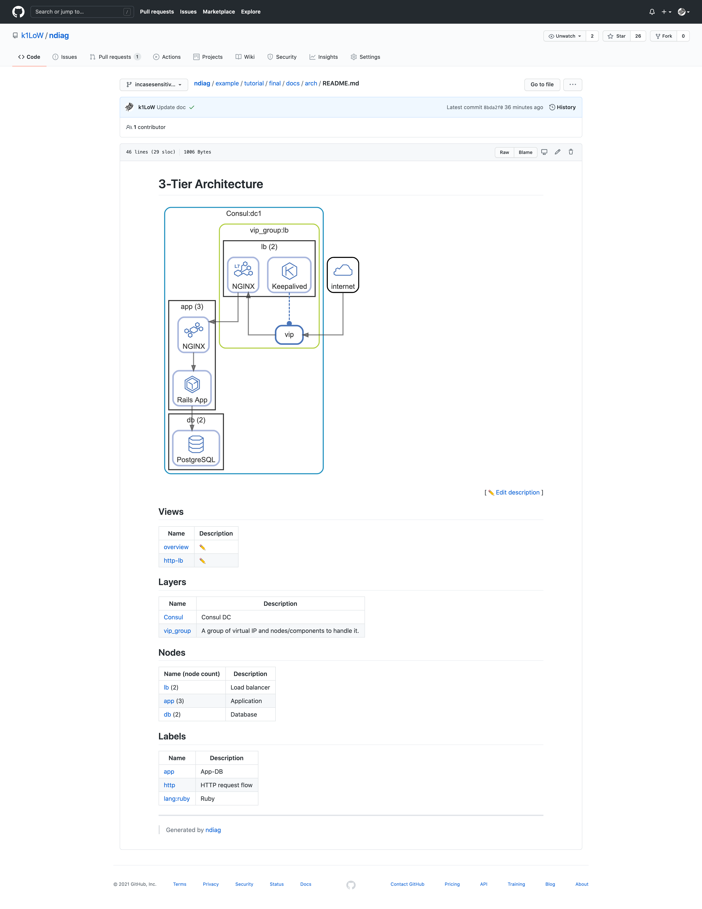

# ndiag

`ndiag` is a "high-level architecture" diagramming/documentation tool.

Key features of `ndiag` are:

- **N**-diagrams: Generate multiple "diagrams and documents" (views) from a single configuration.
- **N**ested-clusters: Nodes and components can be clustered in nested layers
- Provides the ability to check the difference between the architecture and the actual system.

## Usage

``` console
$ ndiag doc -c ndiag.yml --rm-dist
```

## Getting Started

### Generate architecture documents

Add `ndiag.yml` (Full version is [here](example/tutorial/final/ndiag.yml)).

```yaml
---
name: 3-Tier Architecture
docPath: docs/arch
views:
  -
    name: overview
    layers: ["consul", "vip_group"]
  -
    name: http-lb
    layers: ["vip_group"]
    labels: ["http"]
nodes:
  -
    name: lb
    match: lb-*
    components:
      - NGINX?icon=lb-l7
    clusters:
      - 'Consul:dc1'
      - 'vip_group:lb'
  -
    name: app
    match: app-*
    components:
      - NGINX?icon=proxy
      - Rails App?icon=cube4&label=lang:ruby
    clusters:
      - 'Consul:dc1'
  -
    name: db
    match: db-*
    components:
      - PostgreSQL?icon=db
    clusters:
[...]
```

Run `ndiag doc` to generate documents in GitHub Friendly Markdown format.

``` console
$ ndiag doc -c ndiag.yml
```

Commit `ndiag.yml` and documents.

``` console
$ git add ndiag.yml doc/arch ndiag.description
$ git commit -m 'Add architecture document'
$ git push origin main
```

View the document on GitHub.

[Example document](example/tutorial/final/docs/arch/README.md)



## Tutorial

- [English](docs/tutorial.md)
- [日本語](docs/tutorial.ja.md)

## Install

**deb:**

``` console
$ export NDIAG_VERSION=X.X.X
$ curl -o ndiag.deb -L https://github.com/k1LoW/ndiag/releases/download/v$NDIAG_VERSION/ndiag_$NDIAG_VERSION-1_amd64.deb
$ dpkg -i ndiag.deb
```

**RPM:**

``` console
$ export NDIAG_VERSION=X.X.X
$ yum install https://github.com/k1LoW/ndiag/releases/download/v$NDIAG_VERSION/ndiag_$NDIAG_VERSION-1_amd64.rpm
```

**apk:**

``` console
$ export NDIAG_VERSION=X.X.X
$ curl -o ndiag.apk -L https://github.com/k1LoW/ndiag/releases/download/v$NDIAG_VERSION/ndiag_$NDIAG_VERSION-1_amd64.apk
$ apk add ndiag.apk
```

**homebrew tap:**

```console
$ brew install k1LoW/tap/ndiag
```

**manually:**

Download binary from [releases page](https://github.com/k1LoW/ndiag/releases)

**go install:**

```console
$ go install github.com/k1LoW/ndiag@latest
```

**docker:**

```console
$ docker pull ghcr.io/k1low/ndiag:latest
```

**temporary:**

``` console
$ source <(curl https://git.io/ndiag)
```

``` console
$ curl -sL https://git.io/ndiag > /tmp/ndiag.tmp && . /tmp/ndiag.tmp
```
