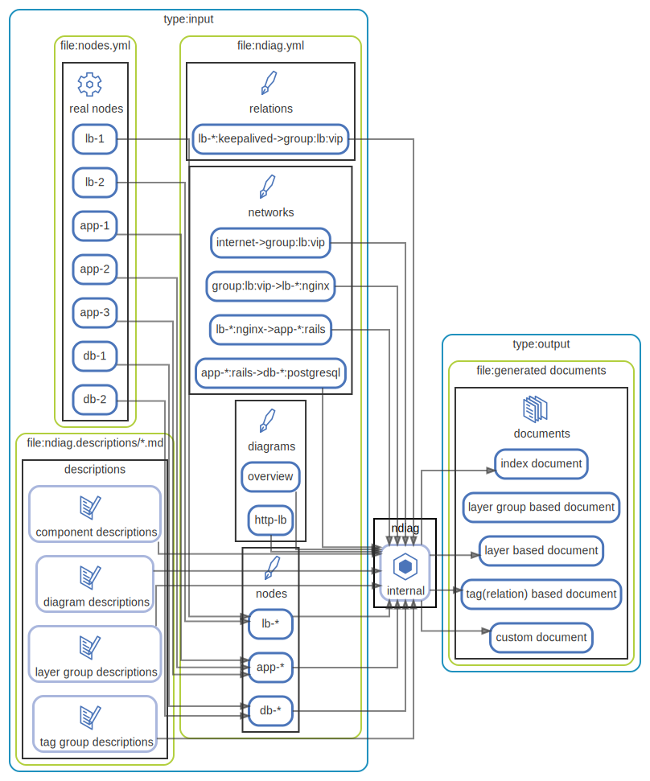

# ndiag アーキテクチャ



本ドキュメントは、`ndiag doc` コマンドを実行したときのドキュメント生成の仕組みを紹介することでndiagのアーキテクチャを説明するものです。

#### 説明に利用するサンプルアーキテクチャ

サンプルとしてnginx, Rails, PostgreSQLで構成された[3層アーキテクチャのドキュメント](/sample/3-tier/output/README.md)を例に説明します。


具体的に実行するコマンドは以下です。

``` console
$ ndiag doc -c sample/3-tier/input/ndiag.yml -n sample/3-tier/input/nodes.yml --rm-dist
```

### ドキュメントの運用サイクル

`ndiag doc` は nodes.yml, ndiag.yml, ndiag.descriptions/*.mdの3種類の入力からアーキテクチャドキュメントを出力します。

ndiagを使ったアーキテクチャドキュメントの運用サイクルは以下のようになります。

1. nodes.yml, ndiag.ymlを用意
2. `ndiag doc` を実行して、空のndiag.descriptions/*.mdとアーキテクチャドキュメントを出力
3. ndiag.descriptions/*.md にアーキテクチャの説明文章を記入、またはnodes.yml, ndiag.ymlの修正
4. `ndiag doc` を実行して、nodes.yml, ndiag.yml, 説明文章を記入したndiag.descriptions/*.mdからアーキテクチャドキュメントを出力
5. -> 3へ

入力と出力の処理の詳細は以下より確認できます。

- [入力](diagram-input.md)
- [出力](diagram-output.md)

### Node

Nodeはアーキテクチャを構成する要素の表現の1つです。

サンプルアーキテクチャでは `app-*` `lb-*` などの、サーバインスタンスを表しています。

node id = `[node name]`

### Layer

NodeやComponentをグルーピングするための基準です。

サンプルアーキテクチャではConsul DCを表すLayerとして `consul` 、Virtual IPが関係するLayerとして `vip_group` を追加しています。

Layerの基準に沿ってClusterを定義していきます。

layer id = `[layer name]`

### Cluster

Layerの基準でグルーピングしたグループです。

ClusterにはNodeやComponentが所属します。

サンプルアーキテクチャでは `dc1` のConsul DCに所属しているNodeを `consul:dc1` に、lbが利用するVirtual IPが関係するNode, Componentを `vip_group:lb` に所属させています。

cluster id = `[layer name]:[cluster name]`

### Component

ComponentはNodeと同様にアーキテクチャを構成する要素の表現の1つです。

ComponentはRelationやNetworkで関係性を記述することができる唯一の要素です。

Componentは以下の3種類に分類されます。

**global component:**

NodeにもClusterにも所属しないComponentです。

component id = `[component name]`

**cluster component:**

Nodeには所属しないがClusterに所属するComponentです。

component id = `[layer name]:[cluster name]:[component name]`

**node component:**

Nodeに所属するComponentです。

component id = `[node name]:[component name]`


<p align="right">
  [ <a href="../ndiag.descriptions.ja/_index.md">:pencil2: Edit description</a> ]
<p>


## 処理の流れ

| Name | Description |
| --- | --- |
| [overview](diagram-overview.md) | 全体イメージ |
| [input](diagram-input.md) | 入力 ... |
| [output](diagram-output.md) | 出力 (アーキテクチャドキュメント) ... |


## 構成要素

| Name | Description |
| --- | --- |
| [input files](node-input_files.md) | <a href="../ndiag.descriptions.ja/_node-input_files.md">:pencil2:</a> |
| [ndiag](node-ndiag.md) | `ndiag doc` コマンド |
| [documents](node-documents.md) | 出力されるアーキテクチャドキュメント ( [sample](/sample/output/README.md) ) |


---

> Generated by [ndiag](https://github.com/k1LoW/ndiag)
