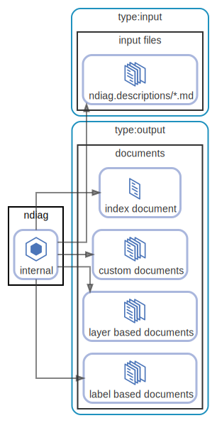

# output

## 出力 (アーキテクチャドキュメント)

`ndiag doc` が出力するドキュメントは ndiag.yml の `docPath` に設定されたディレクトリに生成されます。

- [output/README.md (docPath)](/sample/output/README.md)

ドキュメントは1つではなく、複数の異なる角度から生成します。

### index document

[output/README.md (docPath)](/sample/output/README.md)

### layer based document

ndiag.ymlで設定したLayerごとにドキュメントを生成します。

それぞれのLayerを中心とした説明をすることに使用します。

- [output/layer-consul.md](/sample/output/layer-consul.md)

### tag(relation) based document

ndiag.ymlで設定したrelationsやnetworksに付与したTagごとにドキュメントを生成します。

Tagで表したComponentの関係を中心とした説明をすることに使用します。

- [output/tag-http.md](/sample/output/tag-http.md)

### custom document

ndiag.ymlのdiagramsで設定したlayers、tagsを元にドキュメントを生成します。

- [output/diagram-http-lb.md](/sample/output/diagram-http-lb.md)

  [ <a href="../ndiag.descriptions.ja/_diagram-output.md">:pencil2: Edit description</a> ]

## 構成要素

| Name | Description |
| --- | --- |
| [ndiag](node-ndiag.md) | `ndiag doc` コマンド |
| [documents](node-documents.md) | 出力されるアーキテクチャドキュメント ( [sample](/sample/output/README.md) ) |

---

> Generated by [ndiag](https://github.com/k1LoW/ndiag)
