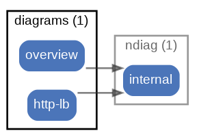

# diagrams



[custom document](node-documents.md#components) を生成するための設定 ( [sample](/sample/input/ndiag.yml#L5-L12) )

サンプルアーキテクチャのndiag.ymlの `diagrams:` の設定は以下のようになっています。

``` yaml
diagrams:
  -
    name: overview
    layers: ["consul", "vip_group"]
  -
    name: http-lb
    layers: ["vip_group"]
    tags: ["http"]
```

`layers:` にClusterがうまく入子構造になるようにLayerを設定することで意図したグルーピングでNodeやComponentを配置した図とドキュメントの雛形を作成できます。

また、`tags:` でTagを（複数）指定することで、Tagで関係性を持ったコンポーネントだけに限定した図とドキュメントの雛形を作成できます。


<p align="right">
  [ <a href="../ndiag.descriptions.ja/_node-diagrams.md">:pencil2: Edit description</a> ]
<p>

## Components

| Name | Description | From (Relation) | To (Relation) |
| --- | --- | --- | --- |
| diagrams:overview |  <a href="../ndiag.descriptions.ja/_component-diagrams_overview.md">:pencil2:</a> |  | [ndiag:internal](node-ndiag.md) |
| diagrams:http-lb |  <a href="../ndiag.descriptions.ja/_component-diagrams_http-lb.md">:pencil2:</a> |  | [ndiag:internal](node-ndiag.md) |


---

> Generated by [ndiag](https://github.com/k1LoW/ndiag)
