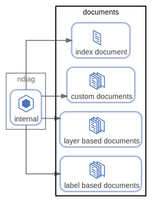

# documents

出力されるアーキテクチャドキュメント ( [example](/example/output/README.md) )

  [ <a href="../ndiag.descriptions.ja/_node-documents.md">:pencil2: Edit description</a> ]

## Components

| Name | Description | From (Relation) | To (Relation) |
| --- | --- | --- | --- |
| documents:index document |  <a href="../ndiag.descriptions.ja/_component-documents_index_document.md">:pencil2:</a> | [ndiag:internal](node-ndiag.md) |  |
| documents:custom documents |  <a href="../ndiag.descriptions.ja/_component-documents_custom_documents.md">:pencil2:</a> | [ndiag:internal](node-ndiag.md) |  |
| documents:layer based documents |  <a href="../ndiag.descriptions.ja/_component-documents_layer_based_documents.md">:pencil2:</a> | [ndiag:internal](node-ndiag.md) |  |
| documents:label based documents |  <a href="../ndiag.descriptions.ja/_component-documents_label_based_documents.md">:pencil2:</a> | [ndiag:internal](node-ndiag.md) |  |

---

> Generated by [ndiag](https://github.com/k1LoW/ndiag)
