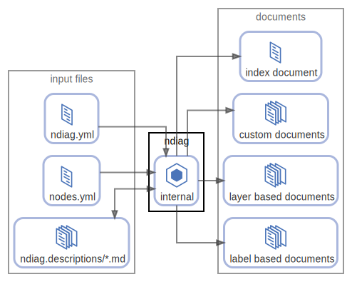

# ndiag

`ndiag doc` コマンド

  [ <a href="../ndiag.descriptions.ja/_node-ndiag.md">:pencil2: Edit description</a> ]

## Components

| Name | Description | From (Relation) | To (Relation) |
| --- | --- | --- | --- |
| ndiag:internal | ndiagの内部処理 <a href="../ndiag.descriptions.ja/_component-ndiag_internal.md">:pencil2:</a> | [input files:ndiag.yml](node-input_files.md) / [input files:nodes.yml](node-input_files.md) / [input files:ndiag.descriptions/*.md](node-input_files.md) | [input files:ndiag.descriptions/*.md](node-input_files.md) / [documents:index document](node-documents.md) / [documents:custom documents](node-documents.md) / [documents:layer based documents](node-documents.md) / [documents:label based documents](node-documents.md) |

---

> Generated by [ndiag](https://github.com/k1LoW/ndiag)
