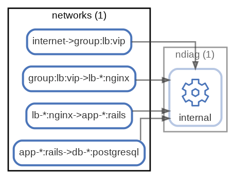

# networks

Component間のネットワーク ( [sample](/sample/input/ndiag.yml#L34-L59) )

サンプルではndiag.ymlに記述していますが、nodes.ymlに記述することも可能です。

  [ <a href="../ndiag.descriptions.ja/_node-networks.md">:pencil2: Edit description</a> ]

## Components

| Name | Description | From (Relation) | To (Relation) |
| --- | --- | --- | --- |
| networks:internet->group:lb:vip |  <a href="../ndiag.descriptions.ja/_component-networks_internet-_group_lb_vip.md">:pencil2:</a> |  | [ndiag:internal](node-ndiag.md) |
| networks:group:lb:vip->lb-*:nginx |  <a href="../ndiag.descriptions.ja/_component-networks_group_lb_vip-_lb-__nginx.md">:pencil2:</a> |  | [ndiag:internal](node-ndiag.md) |
| networks:lb-*:nginx->app-*:rails |  <a href="../ndiag.descriptions.ja/_component-networks_lb-__nginx-_app-__rails.md">:pencil2:</a> |  | [ndiag:internal](node-ndiag.md) |
| networks:app-*:rails->db-*:postgresql |  <a href="../ndiag.descriptions.ja/_component-networks_app-__rails-_db-__postgresql.md">:pencil2:</a> |  | [ndiag:internal](node-ndiag.md) |

---

> Generated by [ndiag](https://github.com/k1LoW/ndiag)
