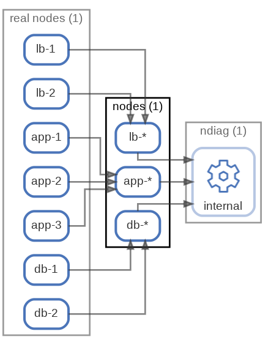

# nodes



Nodeをまとめるための設定 ( [sample](/sample/input/ndiag.yml#L13-L32) )

nodes.ymlに以下のように3つのNodeがあり、

``` yml
- app-1
- app-2
- app-3
```

ndiag.ymlにワイルドカードを含んだ `app-*` がある場合、アーキテクチャドキュメントでは `app-1` `app-2` `app-3` は `app-*` にまとめられて表現されます。

これは、スケールアウトさせている同じ構成のインスタンスをドキュメントでわかりやすく省略表現する場合などに利用します。

``` yml
nodes:
  -
    name: app-*
    components:
      - rails
    clusters:
      - 'consul:dc1'
```


<p align="right">
  [ <a href="../ndiag.descriptions.ja/_node-nodes.md">:pencil2: Edit description</a> ]
<p>

## Components

| Name | Description | From (Relation) | To (Relation) |
| --- | --- | --- | --- |
| nodes:lb-* |  <a href="../ndiag.descriptions.ja/_component-nodes_lb-_.md">:pencil2:</a> | [real nodes:lb-1](node-real_nodes.md) / [real nodes:lb-2](node-real_nodes.md) | [ndiag:internal](node-ndiag.md) |
| nodes:app-* |  <a href="../ndiag.descriptions.ja/_component-nodes_app-_.md">:pencil2:</a> | [real nodes:app-1](node-real_nodes.md) / [real nodes:app-2](node-real_nodes.md) / [real nodes:app-3](node-real_nodes.md) | [ndiag:internal](node-ndiag.md) |
| nodes:db-* |  <a href="../ndiag.descriptions.ja/_component-nodes_db-_.md">:pencil2:</a> | [real nodes:db-1](node-real_nodes.md) / [real nodes:db-2](node-real_nodes.md) | [ndiag:internal](node-ndiag.md) |


---

> Generated by [ndiag](https://github.com/k1LoW/ndiag)
