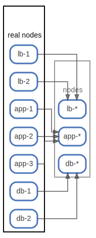

# real nodes

信頼できる情報源から得たNode ( [sample](/sample/input/nodes.yml#L1-L7) )

例では、Terraformの `*.tf` や `*.tfstate`、Chefの `nodes/` ファイルから得たインスタンスの情報をNodeとしています。

例ではNodeの情報のみですが、Nodeに付随するComponentやRelationの情報も渡すことができます。

  [ <a href="../ndiag.descriptions.ja/_node-real_nodes.md">:pencil2: Edit description</a> ]

## Components

| Name | Description | From (Relation) | To (Relation) |
| --- | --- | --- | --- |
| real nodes:lb-1 |  <a href="../ndiag.descriptions.ja/_component-real_nodes_lb-1.md">:pencil2:</a> |  | [nodes:lb-*](node-nodes.md) |
| real nodes:lb-2 |  <a href="../ndiag.descriptions.ja/_component-real_nodes_lb-2.md">:pencil2:</a> |  | [nodes:lb-*](node-nodes.md) |
| real nodes:app-1 |  <a href="../ndiag.descriptions.ja/_component-real_nodes_app-1.md">:pencil2:</a> |  | [nodes:app-*](node-nodes.md) |
| real nodes:app-2 |  <a href="../ndiag.descriptions.ja/_component-real_nodes_app-2.md">:pencil2:</a> |  | [nodes:app-*](node-nodes.md) |
| real nodes:app-3 |  <a href="../ndiag.descriptions.ja/_component-real_nodes_app-3.md">:pencil2:</a> |  | [nodes:app-*](node-nodes.md) |
| real nodes:db-1 |  <a href="../ndiag.descriptions.ja/_component-real_nodes_db-1.md">:pencil2:</a> |  | [nodes:db-*](node-nodes.md) |
| real nodes:db-2 |  <a href="../ndiag.descriptions.ja/_component-real_nodes_db-2.md">:pencil2:</a> |  | [nodes:db-*](node-nodes.md) |

---

> Generated by [ndiag](https://github.com/k1LoW/ndiag)
