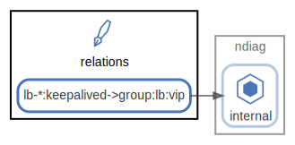

# relations

Component間の関係情報 ( [sample](/sample/input/ndiag.yml#L61-L67) )

  [ <a href="../ndiag.descriptions.ja/_node-relations.md">:pencil2: Edit description</a> ]

## Components

| Name | Description | From (Relation) | To (Relation) |
| --- | --- | --- | --- |
| relations:lb-*:keepalived->group:lb:vip |  <a href="../ndiag.descriptions.ja/_component-relations_lb-__keepalived-_group_lb_vip.md">:pencil2:</a> |  | [ndiag:internal](node-ndiag.md) |

---

> Generated by [ndiag](https://github.com/k1LoW/ndiag)
