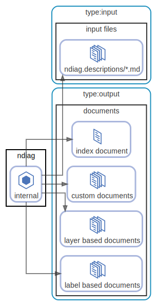
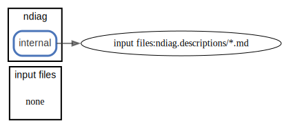
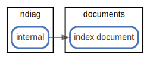
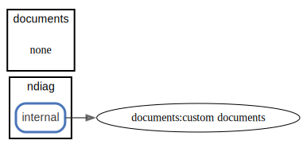
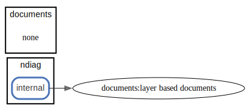

# output

## 出力 (アーキテクチャドキュメント)

`ndiag doc` が出力するドキュメントは ndiag.yml の `docPath` に設定されたディレクトリ（デフォルトは `archdoc` ）に生成されます。

- [output/README.md (docPath)](/example/3-tier/output/README.md)

ドキュメントは1つではなく、複数生成します。

### index document

[output/README.md (docPath)](/example/3-tier/output/README.md)

### layer based document

ndiag.ymlで設定したLayerごとにドキュメントを生成します。

それぞれのLayerを中心とした説明をすることに使用します。

- [output/layer-consul.md](/example/3-tier/output/layer-consul.md)

### label based document

ndiag.ymlで設定したrelationsやnetworksに付与したLabelごとにドキュメントを生成します。

Labelで表したComponentの関係を中心とした説明をすることに使用します。

- [output/label-http.md](/example/3-tier/output/label-http.md)

### custom document

ndiag.ymlのviewsで設定したlayers、labelsを元にドキュメントを生成します。

- [output/view-http-lb.md](/example/3-tier/output/view-http-lb.md)

  [ <a href="../ndiag.descriptions.ja/_view-output.md">:pencil2: Edit description</a> ]

## 構成要素

| Name | Description |
| --- | --- |
| [input files](node-input_files.md) | <a href="../ndiag.descriptions.ja/_node-input_files.md">:pencil2:</a> |
| [ndiag](node-ndiag.md) | `ndiag doc` コマンド |
| [documents](node-documents.md) | 出力されるアーキテクチャドキュメント ( [example](/example/output/README.md) ) |

## Relations

  [ <a href="../ndiag.descriptions.ja/_relation-ndiag_internal-5df3e05.md">:pencil2: Edit description</a> ]

| # | Component | Description |
| --- | --- | --- |
| 0 | ndiag:internal | ndiagの内部処理 <a href="../ndiag.descriptions.ja/_component-ndiag_internal.md">:pencil2:</a> |
| 1 | input files:ndiag.descriptions/*.md |  <a href="../ndiag.descriptions.ja/_component-input_files_ndiag.descriptions__.md.md">:pencil2:</a> |

---

  [ <a href="../ndiag.descriptions.ja/_relation-ndiag_internal-ee6a0d2.md">:pencil2: Edit description</a> ]

| # | Component | Description |
| --- | --- | --- |
| 0 | ndiag:internal | ndiagの内部処理 <a href="../ndiag.descriptions.ja/_component-ndiag_internal.md">:pencil2:</a> |
| 1 | documents:index document |  <a href="../ndiag.descriptions.ja/_component-documents_index_document.md">:pencil2:</a> |

---

  [ <a href="../ndiag.descriptions.ja/_relation-ndiag_internal-8143d95.md">:pencil2: Edit description</a> ]

| # | Component | Description |
| --- | --- | --- |
| 0 | ndiag:internal | ndiagの内部処理 <a href="../ndiag.descriptions.ja/_component-ndiag_internal.md">:pencil2:</a> |
| 1 | documents:custom documents |  <a href="../ndiag.descriptions.ja/_component-documents_custom_documents.md">:pencil2:</a> |

---

  [ <a href="../ndiag.descriptions.ja/_relation-ndiag_internal-eece4dd.md">:pencil2: Edit description</a> ]

| # | Component | Description |
| --- | --- | --- |
| 0 | ndiag:internal | ndiagの内部処理 <a href="../ndiag.descriptions.ja/_component-ndiag_internal.md">:pencil2:</a> |
| 1 | documents:layer based documents |  <a href="../ndiag.descriptions.ja/_component-documents_layer_based_documents.md">:pencil2:</a> |

---

  [ <a href="../ndiag.descriptions.ja/_relation-ndiag_internal-9d28271.md">:pencil2: Edit description</a> ]

| # | Component | Description |
| --- | --- | --- |
| 0 | ndiag:internal | ndiagの内部処理 <a href="../ndiag.descriptions.ja/_component-ndiag_internal.md">:pencil2:</a> |
| 1 | documents:label based documents |  <a href="../ndiag.descriptions.ja/_component-documents_label_based_documents.md">:pencil2:</a> |

---
---

> Generated by [ndiag](https://github.com/k1LoW/ndiag)
