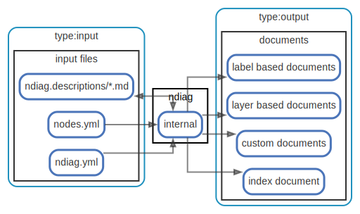

# overview

  [ <a href="../ndiag.descriptions.ja/_view-overview.md">:pencil2: Edit description</a> ]

## 構成要素

| Name | Description |
| --- | --- |
| [input files](node-input_files.md) | <a href="../ndiag.descriptions.ja/_node-input_files.md">:pencil2:</a> |
| [ndiag](node-ndiag.md) | `ndiag doc` コマンド |
| [documents](node-documents.md) | 出力されるアーキテクチャドキュメント ( [example](/example/output/README.md) ) |

---

> Generated by [ndiag](https://github.com/k1LoW/ndiag)
