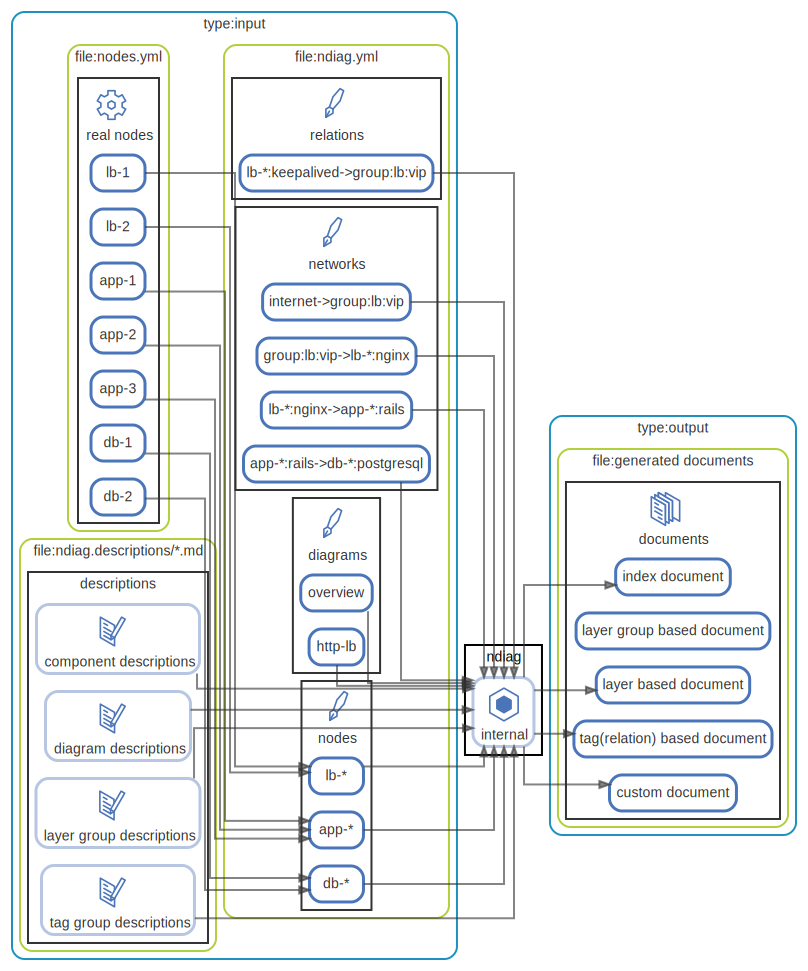

# ndiag architecture



This document explains how ndiag generates the architecture documentation when you actually run the following commands.

#### Sample Architecture

WIP

[3-Tier Architecture](/sample/3-tier/output/README.md)


``` console
$ ndiag doc -c sample/3-tier/input/ndiag.yml -n sample/3-tier/input/nodes.yml --rm-dist
```

### Documentation cycle

WIP

#### Input

WIP

#### Output (architecture document)

WIP

### Node

node id = `[node name]`

### Layer

layer id = `[layer name]`

### Cluster

cluster id = `[layer name]:[cluster name]`

### Component

**global component:**

component id = `[component name]`

**cluster component:**

component id = `[layer name]:[cluster name]:[component name]`

**node component:**

component id = `[node name]:[component name]`


<p align="right">
  [ <a href="../ndiag.descriptions/_index.md">:pencil2: Edit description</a> ]
<p>


## Diagrams

| Name | Description |
| --- | --- |
| [overview](diagram-overview.md) | <a href="../ndiag.descriptions/_diagram-overview.md">:pencil2:</a> |
| [input](diagram-input.md) | <a href="../ndiag.descriptions/_diagram-input.md">:pencil2:</a> |
| [output](diagram-output.md) | <a href="../ndiag.descriptions/_diagram-output.md">:pencil2:</a> |


## Components

| Name | Description |
| --- | --- |
| [input files](node-input_files.md) | <a href="../ndiag.descriptions/_node-input_files.md">:pencil2:</a> |
| [ndiag](node-ndiag.md) | `ndiag doc` command |
| [documents](node-documents.md) | <a href="../ndiag.descriptions/_node-documents.md">:pencil2:</a> |


---

> Generated by [ndiag](https://github.com/k1LoW/ndiag)
