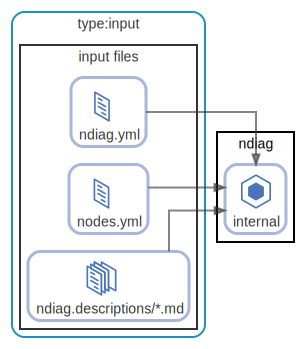

# input

  [ <a href="../ndiag.descriptions/_diagram-input.md">:pencil2: Edit description</a> ]

## Components

| Name | Description |
| --- | --- |
| [input files](node-input_files.md) | <a href="../ndiag.descriptions/_node-input_files.md">:pencil2:</a> |
| [ndiag](node-ndiag.md) | `ndiag doc` command |

---

> Generated by [ndiag](https://github.com/k1LoW/ndiag)
