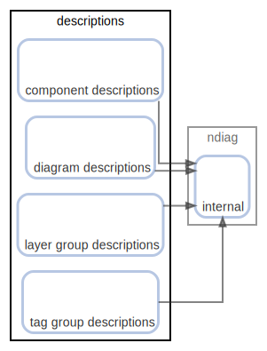

# descriptions

  [ <a href="../ndiag.descriptions/_node-descriptions.md">:pencil2: Edit description</a> ]

## Components

| Name | Description | From (Relation) | To (Relation) |
| --- | --- | --- | --- |
| descriptions:component descriptions |  <a href="../ndiag.descriptions/_component-descriptions_component_descriptions.md">:pencil2:</a> |  | [ndiag:internal](node-ndiag.md) |
| descriptions:diagram descriptions |  <a href="../ndiag.descriptions/_component-descriptions_diagram_descriptions.md">:pencil2:</a> |  | [ndiag:internal](node-ndiag.md) |
| descriptions:layer group descriptions |  <a href="../ndiag.descriptions/_component-descriptions_layer_group_descriptions.md">:pencil2:</a> |  | [ndiag:internal](node-ndiag.md) |
| descriptions:tag group descriptions |  <a href="../ndiag.descriptions/_component-descriptions_tag_group_descriptions.md">:pencil2:</a> |  | [ndiag:internal](node-ndiag.md) |

---

> Generated by [ndiag](https://github.com/k1LoW/ndiag)
