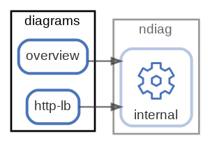

# diagrams

  [ <a href="../ndiag.descriptions/_node-diagrams.md">:pencil2: Edit description</a> ]

## Components

| Name | Description | From (Relation) | To (Relation) |
| --- | --- | --- | --- |
| diagrams:overview |  <a href="../ndiag.descriptions/_component-diagrams_overview.md">:pencil2:</a> |  | [ndiag:internal](node-ndiag.md) |
| diagrams:http-lb |  <a href="../ndiag.descriptions/_component-diagrams_http-lb.md">:pencil2:</a> |  | [ndiag:internal](node-ndiag.md) |

---

> Generated by [ndiag](https://github.com/k1LoW/ndiag)
