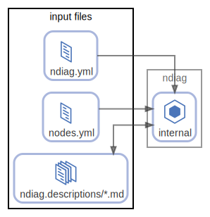

# input files

  [ <a href="../ndiag.descriptions/_node-input_files.md">:pencil2: Edit description</a> ]

## Components

| Name | Description | From (Relation) | To (Relation) |
| --- | --- | --- | --- |
| input files:ndiag.yml |  <a href="../ndiag.descriptions/_component-input_files_ndiag.yml.md">:pencil2:</a> |  | [ndiag:internal](node-ndiag.md) |
| input files:nodes.yml |  <a href="../ndiag.descriptions/_component-input_files_nodes.yml.md">:pencil2:</a> |  | [ndiag:internal](node-ndiag.md) |
| input files:ndiag.descriptions/*.md |  <a href="../ndiag.descriptions/_component-input_files_ndiag.descriptions__.md.md">:pencil2:</a> | [ndiag:internal](node-ndiag.md) | [ndiag:internal](node-ndiag.md) |

---

> Generated by [ndiag](https://github.com/k1LoW/ndiag)
