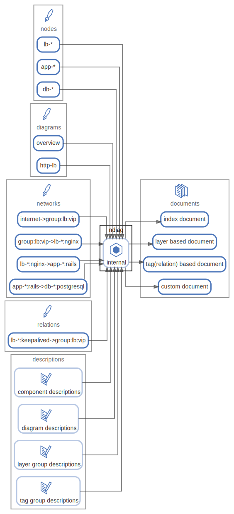

# ndiag

`ndiag doc` command

  [ <a href="../ndiag.descriptions/_node-ndiag.md">:pencil2: Edit description</a> ]

## Components

| Name | Description | From (Relation) | To (Relation) |
| --- | --- | --- | --- |
| ndiag:internal |  <a href="../ndiag.descriptions/_component-ndiag_internal.md">:pencil2:</a> | [nodes:lb-*](node-nodes.md) / [nodes:app-*](node-nodes.md) / [nodes:db-*](node-nodes.md) / [diagrams:overview](node-diagrams.md) / [diagrams:http-lb](node-diagrams.md) / [networks:internet->group\:lb\:vip](node-networks.md) / [networks:group\:lb\:vip->lb-*\:nginx](node-networks.md) / [networks:lb-*\:nginx->app-*\:rails](node-networks.md) / [networks:app-*\:rails->db-*\:postgresql](node-networks.md) / [relations:lb-*\:keepalived->group\:lb\:vip](node-relations.md) / [descriptions:component descriptions](node-descriptions.md) / [descriptions:diagram descriptions](node-descriptions.md) / [descriptions:layer group descriptions](node-descriptions.md) / [descriptions:label group descriptions](node-descriptions.md) | [documents:index document](node-documents.md) / [documents:custom document](node-documents.md) / [documents:layer based document](node-documents.md) / [documents:label(relation) based document](node-documents.md) |

---

> Generated by [ndiag](https://github.com/k1LoW/ndiag)
