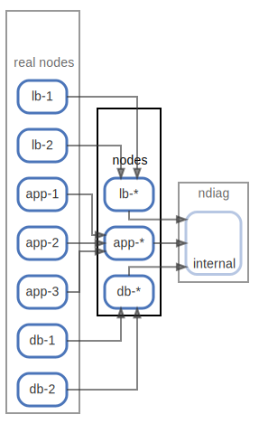

# nodes

  [ <a href="../ndiag.descriptions/_node-nodes.md">:pencil2: Edit description</a> ]

## Components

| Name | Description | From (Relation) | To (Relation) |
| --- | --- | --- | --- |
| nodes:lb-* |  <a href="../ndiag.descriptions/_component-nodes_lb-_.md">:pencil2:</a> | [real nodes:lb-1](node-real_nodes.md) / [real nodes:lb-2](node-real_nodes.md) | [ndiag:internal](node-ndiag.md) |
| nodes:app-* |  <a href="../ndiag.descriptions/_component-nodes_app-_.md">:pencil2:</a> | [real nodes:app-1](node-real_nodes.md) / [real nodes:app-2](node-real_nodes.md) / [real nodes:app-3](node-real_nodes.md) | [ndiag:internal](node-ndiag.md) |
| nodes:db-* |  <a href="../ndiag.descriptions/_component-nodes_db-_.md">:pencil2:</a> | [real nodes:db-1](node-real_nodes.md) / [real nodes:db-2](node-real_nodes.md) | [ndiag:internal](node-ndiag.md) |

---

> Generated by [ndiag](https://github.com/k1LoW/ndiag)
