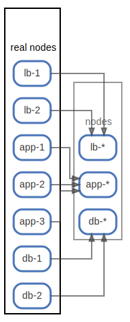

# real nodes

  [ <a href="../ndiag.descriptions/_node-real_nodes.md">:pencil2: Edit description</a> ]

## Components

| Name | Description | From (Relation) | To (Relation) |
| --- | --- | --- | --- |
| real nodes:lb-1 | in [nodes.yml](/sample/input/nodes.yml) <a href="../ndiag.descriptions/_component-real_nodes_lb-1.md">:pencil2:</a> |  | [nodes:lb-*](node-nodes.md) |
| real nodes:lb-2 | in [nodes.yml](/sample/input/nodes.yml) <a href="../ndiag.descriptions/_component-real_nodes_lb-2.md">:pencil2:</a> |  | [nodes:lb-*](node-nodes.md) |
| real nodes:app-1 | in [nodes.yml](/sample/input/nodes.yml) <a href="../ndiag.descriptions/_component-real_nodes_app-1.md">:pencil2:</a> |  | [nodes:app-*](node-nodes.md) |
| real nodes:app-2 | in [nodes.yml](/sample/input/nodes.yml) <a href="../ndiag.descriptions/_component-real_nodes_app-2.md">:pencil2:</a> |  | [nodes:app-*](node-nodes.md) |
| real nodes:app-3 | in [nodes.yml](/sample/input/nodes.yml) <a href="../ndiag.descriptions/_component-real_nodes_app-3.md">:pencil2:</a> |  | [nodes:app-*](node-nodes.md) |
| real nodes:db-1 | in [nodes.yml](/sample/input/nodes.yml) <a href="../ndiag.descriptions/_component-real_nodes_db-1.md">:pencil2:</a> |  | [nodes:db-*](node-nodes.md) |
| real nodes:db-2 | in [nodes.yml](/sample/input/nodes.yml) <a href="../ndiag.descriptions/_component-real_nodes_db-2.md">:pencil2:</a> |  | [nodes:db-*](node-nodes.md) |

---

> Generated by [ndiag](https://github.com/k1LoW/ndiag)
