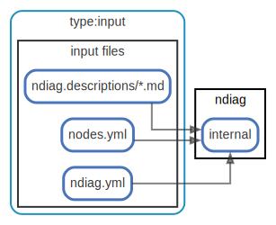

# input

  [ <a href="../ndiag.descriptions/_view-input.md">:pencil2: Edit description</a> ]

## Components

| Name | Description |
| --- | --- |
| [input files](node-input_files.md) | <a href="../ndiag.descriptions/_node-input_files.md">:pencil2:</a> |
| [ndiag](node-ndiag.md) | `ndiag doc` command |

## Relations

  [ <a href="../ndiag.descriptions/_relation-input_files_ndiag.yml-da3a497.md">:pencil2: Edit description</a> ]

| # | Component | Description |
| --- | --- | --- |
| 0 | input files:ndiag.yml |  <a href="../ndiag.descriptions/_component-input_files_ndiag.yml.md">:pencil2:</a> |
| 1 | ndiag:internal |  <a href="../ndiag.descriptions/_component-ndiag_internal.md">:pencil2:</a> |

  [ <a href="../ndiag.descriptions/_relation-input_files_nodes.yml-efaf14b.md">:pencil2: Edit description</a> ]

| # | Component | Description |
| --- | --- | --- |
| 0 | input files:nodes.yml |  <a href="../ndiag.descriptions/_component-input_files_nodes.yml.md">:pencil2:</a> |
| 1 | ndiag:internal |  <a href="../ndiag.descriptions/_component-ndiag_internal.md">:pencil2:</a> |

  [ <a href="../ndiag.descriptions/_relation-input_files_ndiag.descriptions__.md-1cdb9dd.md">:pencil2: Edit description</a> ]

| # | Component | Description |
| --- | --- | --- |
| 0 | input files:ndiag.descriptions/*.md |  <a href="../ndiag.descriptions/_component-input_files_ndiag.descriptions__.md.md">:pencil2:</a> |
| 1 | ndiag:internal |  <a href="../ndiag.descriptions/_component-ndiag_internal.md">:pencil2:</a> |

---

> Generated by [ndiag](https://github.com/k1LoW/ndiag)
