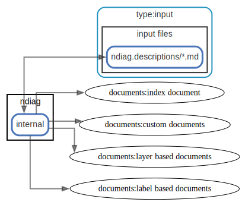

# output

  [ <a href="../ndiag.descriptions/_view-output.md">:pencil2: Edit description</a> ]

## Components

| Name | Description |
| --- | --- |
| [input files](node-input_files.md) | <a href="../ndiag.descriptions/_node-input_files.md">:pencil2:</a> |
| [ndiag](node-ndiag.md) | `ndiag doc` command |
| [documents](node-documents.md) | <a href="../ndiag.descriptions/_node-documents.md">:pencil2:</a> |

## Relations

  [ <a href="../ndiag.descriptions/_relation-ndiag_internal-5df3e05.md">:pencil2: Edit description</a> ]

| # | Component | Description |
| --- | --- | --- |
| 0 | ndiag:internal |  <a href="../ndiag.descriptions/_component-ndiag_internal.md">:pencil2:</a> |
| 1 | input files:ndiag.descriptions/*.md |  <a href="../ndiag.descriptions/_component-input_files_ndiag.descriptions__.md.md">:pencil2:</a> |

  [ <a href="../ndiag.descriptions/_relation-ndiag_internal-ee6a0d2.md">:pencil2: Edit description</a> ]

| # | Component | Description |
| --- | --- | --- |
| 0 | ndiag:internal |  <a href="../ndiag.descriptions/_component-ndiag_internal.md">:pencil2:</a> |
| 1 | documents:index document |  <a href="../ndiag.descriptions/_component-documents_index_document.md">:pencil2:</a> |

  [ <a href="../ndiag.descriptions/_relation-ndiag_internal-8143d95.md">:pencil2: Edit description</a> ]

| # | Component | Description |
| --- | --- | --- |
| 0 | ndiag:internal |  <a href="../ndiag.descriptions/_component-ndiag_internal.md">:pencil2:</a> |
| 1 | documents:custom documents |  <a href="../ndiag.descriptions/_component-documents_custom_documents.md">:pencil2:</a> |

  [ <a href="../ndiag.descriptions/_relation-ndiag_internal-eece4dd.md">:pencil2: Edit description</a> ]

| # | Component | Description |
| --- | --- | --- |
| 0 | ndiag:internal |  <a href="../ndiag.descriptions/_component-ndiag_internal.md">:pencil2:</a> |
| 1 | documents:layer based documents |  <a href="../ndiag.descriptions/_component-documents_layer_based_documents.md">:pencil2:</a> |

  [ <a href="../ndiag.descriptions/_relation-ndiag_internal-9d28271.md">:pencil2: Edit description</a> ]

| # | Component | Description |
| --- | --- | --- |
| 0 | ndiag:internal |  <a href="../ndiag.descriptions/_component-ndiag_internal.md">:pencil2:</a> |
| 1 | documents:label based documents |  <a href="../ndiag.descriptions/_component-documents_label_based_documents.md">:pencil2:</a> |

---

> Generated by [ndiag](https://github.com/k1LoW/ndiag)
