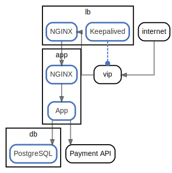
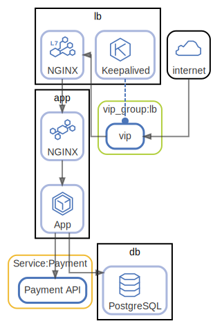

# Tutorial

このチュートリアルでは簡単なWebサービスのアーキテクチャドキュメントを作成します。

`ndiag` コマンドのインストールは ["Install" セクション](../README.md#install)を確認してください。

## STEP1: "Node"や"Component"を使ってインスタンスやインスタンス上のミドルウェアやアプリケーションを表現する

**:pushpin: キーワード:** `Node`, `Component`, `Node component`

まず、以下のようなYAMLドキュメントを `ndiag.yml` として作成します。

```yaml
---
name: Simple web service
docPath: docs/arch
nodes:
  -
    name: lb
    components:
      - NGINX
  -
    name: app
    components:
      - NGINX
      - App
  -
    name: db
    components:
      - PostgreSQL
```
<details>

<summary> Full version of <code>ndiag.yml</code> is here (click).</summary>

``` yaml
---
name: Simple web service
docPath: docs/arch
nodes:
  -
    name: lb
    components:
      - NGINX
  -
    name: app
    components:
      - NGINX
      - App
  -
    name: db
    components:
      - PostgreSQL
```

[ndiag.yml in repo](../example/tutorial/step1/ndiag.yml)

</details>

この `ndiag.yml` では、インスタンスのロール (`lb`, `app`, `db`) を**Node**で、インスタンス上のミドルウェアやアプリケーションを**Component**で表現しています。

NodeもComponentもシステムを構成する要素（アーキテクチャ要素）です。

そして `ndiag doc` コマンドを実行します。

``` console
$ ndiag doc -c ndiag.yml --rm-dist
```

コマンドが成功すると以下のような2つのディレクトリが作成されます。

``` console
$ ls
docs ndiag.descriptions ndiag.yml
$ tree docs/
docs/
└── arch
    ├── README.md
    ├── node-app.md
    ├── node-app.svg
    ├── node-db.md
    ├── node-db.svg
    ├── node-lb.md
    ├── node-lb.svg
    ├── view-nodes.md
    └── view-nodes.svg

1 directory, 9 files
$ tree ndiag.descriptions
ndiag.descriptions
├── _component-app_app.md
├── _component-app_nginx.md
├── _component-db_postgresql.md
├── _component-lb_nginx.md
├── _index.md
├── _node-app.md
├── _node-db.md
├── _node-lb.md
└── _view-nodes.md

0 directories, 9 files
```

| ディレクトリ  | |
| --- | --- |
| `docs/` | 生成されたドキュメント  |
| `ndiad.descriptions` | アーキテクチャ要素の説明をセットするためのサブドキュメント ( STEP7で説明します ) |

`docs/arch/README.md` を開いてみてください。もうアーキテクチャドキュメントの雛形が完成しました。

### :book: このSTEPで生成されたドキュメント


[Generated documents](../example/tutorial/step1/docs/arch/README.md)

### :memo: このSTEPでのポイント

Componentのうち、特にNodeに所属するComponentを**Node component**と呼びます。

## STEP2: データの流れ(HTTPリクエスト/データベースアクセスなど) を"networks:"を使って表現する

**:pushpin: キーワード:** `networks:`, `Global component`

Component間のデータの流れ(HTTPリクエスト/データベースアクセスなど) を `ndiag.yml` に `networks:` を追加することで表現します。

``` yaml
[...]

networks:
  -
    route:
      - "internet"
      - "vip"
  -
    route:
      - "vip"
      - "lb:nginx"
  -
    route:
      - "lb:nginx"
      - "app:nginx"
      - "app:app"
[...]
```
<details>

<summary> Full version of <code>ndiag.yml</code> is here (click).</summary>

``` yaml
---
name: Simple web service
docPath: docs/arch
nodes:
  -
    name: lb
    components:
      - NGINX
  -
    name: app
    components:
      - NGINX
      - App
  -
    name: db
    components:
      - PostgreSQL

networks:
  -
    route:
      - "internet"
      - "vip"
  -
    route:
      - "vip"
      - "lb:nginx"
  -
    route:
      - "lb:nginx"
      - "app:nginx"
      - "app:app"
  -
    route:
      - "app:app"
      - "Payment API"
  -
    route:
      - "app:app"
      - "db:postgresql"
```

[ndiag.yml in repo](../example/tutorial/step2/ndiag.yml)

</details>

そして、STEP1と同様に `ndiag doc` コマンドを実行します。

``` console
$ ndiag doc -c ndiag.yml --rm-dist
```

(STEP2以降も `ndiag doc` コマンドを実行してドキュメントを生成します。)

### :BOOK: このSTEPで生成されたドキュメント


[Generated documents](../example/tutorial/step2/docs/arch/README.md)

### :MEMO: このSTEPでのポイント

Node componentは、Node id(= Node name)とComponent nameを `:` で連結することで指定します。

**:bulb: Example:** `lb:nginx` は "Node `lb` に所属する Component `NGINX`" を意味します。

Node（やCluster）に所属しないComponentと**Global component**と呼びます ( `internet`, `vip`, `Payment API` )。Global componentはComponent nameのみで指定します。

## STEP3: データの流れ以外のComponent間の関係を"relations:"を使用して表現する

**:pushpin: キーワード:** `relations:`

データの流れ以外のComponent間の関係を、以下のように `relations:` を使って表現します。

``` yaml
[...]

relations:
  -
    components:
      - 'lb:Keepalived'
      - "vip"
```
<details>

<summary> Full version of <code>ndiag.yml</code> is here (click).</summary>

``` yaml
---
name: Simple web service
docPath: docs/arch
nodes:
  -
    name: lb
    components:
      - NGINX
  -
    name: app
    components:
      - NGINX
      - App
  -
    name: db
    components:
      - PostgreSQL

networks:
  -
    route:
      - "internet"
      - "vip"
  -
    route:
      - "vip"
      - "lb:nginx"
  -
    route:
      - "lb:nginx"
      - "app:nginx"
      - "app:app"
  -
    route:
      - "app:app"
      - "db:postgresql"
  -
    route:
      - "app:app"
      - "Payment API"

relations:
  -
    components:
      - 'lb:Keepalived'
      - "vip"
```

[ndiag.yml in repo](../example/tutorial/step3/ndiag.yml)

</details>

そして、 `ndiag doc` コマンドを実行します。

``` console
$ ndiag doc -c ndiag.yml --rm-dist
```

### :book: このSTEPで生成されたドキュメント



[Generated documents](../example/tutorial/step3/docs/arch/README.md)

### :memo: このSTEPでのポイント

`networks:` の別の表現として `relations:` の `type: network` があります。どちらを利用しても構いません。

**:bulb: Example:**

以下の2つは同じ意味になります。

<table>
  <tr><th> networks: </th><th> relations: </th></tr>
  <tr>
    <td>
<pre>
networks:
  -
    route:
      - "internet"
      - "vip"
</pre>
    </td>
    <td>
<pre>
relations:
  -
    type: network
    components:
      - "internet"
      - "vip"
</pre>
    </td>
  </tr>
</table>

## STEP4: "Cluster" を使ってNodeやComponentをグルーピングする

**:pushpin: キーワード:** `Cluster`, `Layer`, `Cluster component`

NodeやComponentのグループを `clusters:` で表現します。

``` yaml
[...]
  -
    name: db
    components:
      - PostgreSQL
    clusters:
      - 'consul:dc1'

networks:
  -
    route:
      - "internet"
      - "vip_group:lb:vip"
[...]
```
<details>

<summary> Full version of <code>ndiag.yml</code> is here (click).</summary>

``` yaml
---
name: Simple web service
docPath: docs/arch
nodes:
  -
    name: lb
    components:
      - NGINX
    clusters:
      - 'Consul:dc1'
      - 'vip_group:lb'
  -
    name: app
    components:
      - NGINX
      - App
    clusters:
      - 'consul:dc1'
  -
    name: db
    components:
      - PostgreSQL
    clusters:
      - 'consul:dc1'

networks:
  -
    route:
      - "internet"
      - "vip_group:lb:vip"
  -
    route:
      - "vip_group:lb:vip"
      - "lb:nginx"
  -
    route:
      - "lb:nginx"
      - "app:nginx"
      - "app:app"
  -
    route:
      - "app:app"
      - "db:postgresql"
  -
    route:
      - "app:app"
      - "Service:Payment:Payment API"

relations:
  -
    components:
      - 'lb:Keepalived'
      - "vip_group:lb:vip"
```

[ndiag.yml in repo](../example/tutorial/step4/ndiag.yml)

</details>

### :book: このSTEPで生成されたドキュメント


[Generated documents](../example/tutorial/step4/docs/arch/README.md)

### :memo: このSTEPでのポイント

ndiagではNodeやComponentを**Cluster**という要素でグルーピングできます。

Nodeは複数のClusterに所属できます。

**:bulb: Example:**

``` yaml
[...]
nodes:
  -
    name: instance
    components:
      - http-server
    clusters:
      - 'role:web'
      - 'location:dc'
      - 'os:ubuntu-focal'
[...]
```

Clusterは常に1つの**Layer**に所属しています。Layerは複数のClusterを持つことが可能です。

図では、同じLayerに所属するClusterは同じ色の線で表現されます。

ClusterはLayer id (= Layer name)とCluster nameを `:` で連結することで指定できます。

**:bulb: Example:** Layer `role` は 同じLayer id `role` を持つCluster `role:web` やCluster `role:db` を持っています。

また、NodeではなくClusterに所属するComponentを**Cluster component**と呼びます。

Cluster componentはClusetr idとComponent nameを `:` で連結することで指定できます。

**:bulb: Example:** `vip_group:lb:vip` は"Cluster `vip_group:lb`に所属するComponent `vip`"という意味です。

## STEP5: アイコンを追加する

**:pushpin: キーワード:** `icon`

このSTEPでは、以下のようにComponentやNode、Clusterにアイコンを設定して図をわかりやすくします。

``` yaml
[...]
  -
    name: db
    components:
      - PostgreSQL?icon=db
    clusters:
      - 'consul:dc1'

networks:
  -
    route:
      - "internet?icon=cloud"
      - "vip_group:lb:vip"
[...]
```
<details>

<summary> Full version of <code>ndiag.yml</code> is here (click).</summary>

``` yaml
---
name: Simple web service
docPath: docs/arch
nodes:
  -
    name: lb
    components:
      - NGINX?icon=lb-l7
    clusters:
      - 'Consul:dc1'
      - 'vip_group:lb'
  -
    name: app
    components:
      - NGINX?icon=proxy
      - App?icon=cube4
    clusters:
      - 'consul:dc1'
  -
    name: db
    components:
      - PostgreSQL?icon=db
    clusters:
      - 'consul:dc1'

networks:
  -
    route:
      - "internet?icon=cloud"
      - "vip_group:lb:vip"
  -
    route:
      - "vip_group:lb:vip"
      - "lb:nginx"
  -
    route:
      - "lb:nginx"
      - "app:nginx"
      - "app:app"
  -
    route:
      - "app:app"
      - "db:postgresql"
  -
    route:
      - "app:app"
      - "Service:Payment:Payment API"

relations:
  -
    components:
      - 'lb:Keepalived?icon=keepalived'
      - "vip_group:lb:vip"

customIcons:
  -
    key: keepalived
    lines:
      - b1 b5 f9 j5 j1 f1 b1
      - d2 d6
      - h2 d4
      - e4 h6
```

[ndiag.yml in repo](../example/tutorial/step5/ndiag.yml)

</details>

`ndiag doc` コマンドを実行するとアイコンを含んだ図でドキュメントが生成されます。

``` console
$ ndiag doc -c ndiag.yml --rm-dist
```

### :book: このSTEPで生成されたドキュメント



[Generated documents](../example/tutorial/step5/docs/arch/README.md)

### :memo: このSTEPでのポイント

使用できるアイコンは `ndiag list icons` コマンドで確認できます。

``` console
$ ndiag list icons -c ndiag.yml
```

アイコンを追加する方法は以下の3つです。

1. `customIcons:` セクションで[glyphの記述方式](https://github.com/k1LoW/glyph#concept)でアイコンを表現する
2. アイコンディレクトリ(デフォルト: `ndiag.icons` )を作成し、SVGもしくはPNGファイルを配置する
3. `ndiag fetch-icons` コマンドを実行して、追加のアイコンをアイコンディレクトリにダウンロードする。

また、アイコンを付与できるのはアーキテクチャ要素(Node、Component)とClusterです。

**1. Component**

Component idやComponent nameにクエリパラメータで `icon` を指定することでComponentにアイコンを付与できます。

``` yaml
[...]
nodes:
  -
    name: app
    components:
      - NGINX?icon=proxy
      - App?icon=cube4
[...]
```

**2. Node**

Nodeにアイコンを付与する場合、以下のように `metadata:` に `icon:` を指定します。

``` yaml
[...]
nodes:
  -
    name: lb
    components:
      - NGINX
    metadata:
      icon: lb
[...]
```

**3. Cluster**

Clusterにアイコンを付与する場合、Componentと同様に、以下のようにCluster idにクエリパラメータでアイコンを指定します。

``` yaml
[...]
nodes:
  - name: my-namespace
    clusters:
      - 'k8s:my-cluster?icon=k8s-logo'
[,,,]
```

## STEP6: "Label"や"views:"を使ってアーキテクチャのビュー("View")を作成する

**:pushpin: キーワード:** `View`, `views:`, `Label`

**View**はndiagにとって重要な概念です。

STEP5までで、アーキテクチャ要素とそれらの関係を表現しました。

STEP6では、アーキテクチャを様々な側面から説明するためにViewを作成します。

ndiagでは**Label**を利用してアーキテクチャ要素をフィルタリングすることで、アーキテクチャをある関心事にフォーカスしたドキュメントをViewとして作成できます。

Viewは`views:` で複数定義できます。

``` yaml
[...]
views:
  -
    name: http access
    layers: ["vip_group"]
    labels: ["http"]
[...]
```
<details>

<summary> Full version of <code>ndiag.yml</code> is here (click).</summary>

``` yaml
---
name: Simple web service
docPath: docs/arch
views:
  -
    name: overview
    layers: ["consul", "vip_group", "service"]
  -
    name: http access
    layers: ["vip_group"]
    labels: ["http"]
  -
    name: app
    layers: ["vip_group", "service"]
    labels: ["app"]
nodes:
  -
    name: lb
    components:
      - NGINX?icon=lb-l7
    clusters:
      - 'Consul:dc1'
      - 'vip_group:lb'
  -
    name: app
    components:
      - NGINX?icon=proxy
      - App?icon=cube4&label=lang:ruby
    clusters:
      - 'consul:dc1'
  -
    name: db
    components:
      - PostgreSQL?icon=db
    clusters:
      - 'consul:dc1'

networks:
  -
    labels:
      - http
    route:
      - "internet?icon=cloud"
      - "vip_group:lb:vip"
  -
    labels:
      - http
    route:
      - "vip_group:lb:vip"
      - "lb:nginx"
  -
    labels:
      - http
      - app
    route:
      - "lb:nginx"
      - "app:nginx"
      - "app:app"
  -
    labels:
      - app
    route:
      - "app:app"
      - "db:postgresql"
  -
    labels:
      - app
    route:
      - "app:app"
      - "Service:Payment:Payment API"

relations:
  -
    labels:
      - http
    components:
      - 'lb:Keepalived?icon=keepalived'
      - "vip_group:lb:vip"

customIcons:
  -
    key: keepalived
    lines:
      - b1 b5 f9 j5 j1 f1 b1
      - d2 d6
      - h2 d4
      - e4 h6
```

[ndiag.yml in repo](../example/tutorial/step6/ndiag.yml)

</details>

### :book: このSTEPで生成されたドキュメント


[Generated documents](../example/tutorial/step6/docs/arch/README.md)

### :memo: このSTEPでのポイント

Labelを付与できるのはアーキテクチャ要素（Node、Component）とRelation(Network)です。

**1. Component**

Component idやComponent nameにクエリパラメータで `label` を指定することでComponentにLabelを付与できます。

``` yaml
[...]
nodes:
  -
    name: app
    components:
      - App?label=ruby&label=rails
[...]
```

**2. Node**

NodeにLabelを付与する場合、以下のように `metadata:` に `labels:` を指定します。

``` yaml
[...]
nodes:
  -
    name: lb
    components:
      - NGINX
    metadata:
      labels:
        - http
[...]
```

**3. Relation (Network）**

RelationもしくはNetworkにLabelを付与する場合、`labels:` を指定します。

``` yaml
[...]
networks:
  -
    labels:
      - http
    route:
      - "internet?icon=cloud"
      - "vip_group:lb:vip"
[...]
```

## STEP7: Add description of elements using GitHub Web UI and GitHub Actions

:construction:

### :book: このSTEPで生成されたドキュメント

[Generated documents](../example/tutorial/step7/docs/arch/README.md)

## STEP8: Strict mode

:construction:
