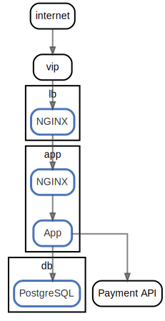

# Tutorial

このチュートリアルでは簡単なWebサービスのアーキテクチャドキュメントを作成します。

`ndiag` コマンドのインストールは ["Install" セクション](../README.md#install)を確認してください。

## STEP1: "Node"や"Component"を使ってインスタンスやインスタンス上のミドルウェアやアプリケーションを定義する

**:pushpin: キーワード:** `Node`, `Component`, `Node component`

まずインスタンスのロールを"Node"で、インスタンス上のミドルウェアやアプリケーションを"Component"で定義します。

以下のようなYAMLドキュメントを `ndiag.yml` として作成します。

```yaml
---
name: Simple web service
docPath: docs/arch
nodes:
  -
    name: lb
    components:
      - NGINX
  -
    name: app
    components:
      - NGINX
      - App
  -
    name: db
    components:
      - PostgreSQL
```
<details>

<summary> Full version of <code>ndiag.yml</code> is here (click).</summary>

``` yaml
---
name: Simple web service
docPath: docs/arch
nodes:
  -
    name: lb
    components:
      - NGINX
  -
    name: app
    components:
      - NGINX
      - App
  -
    name: db
    components:
      - PostgreSQL
```

[ref](../example/tutorial/step1/ndiag.yml)

</details>

そして `ndiag doc` コマンドを実行します。

``` console
$ ndiag doc -c ndiag.yml --rm-dist
```

コマンドが成功すると以下のような2つのディレクトリが作成されます。

``` console
$ ls
docs ndiag.descriptions ndiag.yml
$ tree docs/
docs/
└── arch
    ├── README.md
    ├── node-app.md
    ├── node-app.svg
    ├── node-db.md
    ├── node-db.svg
    ├── node-lb.md
    ├── node-lb.svg
    ├── view-nodes.md
    └── view-nodes.svg

1 directory, 9 files
$ tree ndiag.descriptions
ndiag.descriptions
├── _component-app_app.md
├── _component-app_nginx.md
├── _component-db_postgresql.md
├── _component-lb_nginx.md
├── _index.md
├── _node-app.md
├── _node-db.md
├── _node-lb.md
└── _view-nodes.md

0 directories, 9 files
```

| ディレクトリ  | |
| --- | --- |
| `docs/` | 生成されたドキュメント  |
| `ndiad.descriptions` | アーキテクチャ要素の説明をセットするためのサブドキュメント ( STEP7で説明します ) |

`docs/arch/README.md` を開いてみてください。もうドキュメントの雛形が完成しました。

STEP2以降でアーキテクチャ要素を充実させていきます。

### Output of this step:


[Generated documents](../example/tutorial/step1/docs/arch/README.md)

### Keyword

NodeもComponentもシステムを構成する要素（アーキテクチャ要素）です。

Componentのうち、特にNodeに所属するComponentをNode componentと呼びます。

## STEP2: データの流れ(HTTPリクエスト/データベースアクセスなど) を"networks:"を使って定義する

**:pushpin: Keyword:** `networks:`, `Global component`

Component間のデータの流れ(HTTPリクエスト/データベースアクセスなど) を `ndiag.yml` に `networks:` を追加することで定義します。

``` yaml
[...]

networks:
  -
    route:
      - "internet"
      - "vip"
  -
    route:
      - "vip"
      - "lb:nginx"
  -
    route:
      - "lb:nginx"
      - "app:nginx"
      - "app:app"
[...]
```
<details>

<summary> Full version of <code>ndiag.yml</code> is here (click).</summary>

``` yaml
---
name: Simple web service
docPath: docs/arch
nodes:
  -
    name: lb
    components:
      - NGINX
  -
    name: app
    components:
      - NGINX
      - App
  -
    name: db
    components:
      - PostgreSQL

networks:
  -
    route:
      - "internet"
      - "vip"
  -
    route:
      - "vip"
      - "lb:nginx"
  -
    route:
      - "lb:nginx"
      - "app:nginx"
      - "app:app"
  -
    route:
      - "app:app"
      - "Payment API"
  -
    route:
      - "app:app"
      - "db:postgresql"
```

[ref](../example/tutorial/step2/ndiag.yml)

</details>

そして、STEP1と同様に `ndiag doc` コマンドを実行します。

``` console
$ ndiag doc -c ndiag.yml --rm-dist
```

(STEP2以降も同じコマンドを実行してドキュメントを生成します。)

### Output of this step:



[Generated documents](../example/tutorial/step2/docs/arch/README.md)

### Point of this step:

`networks:` 上ではNode componentを"Node id(= Node name)"と"Component name"を `:` で連結することで指定します。

**:bulb: Example:** `lb:nginx` は "Node `lb` に所属する Component `NGINX`」 を意味します。

Node（やCluster）に所属しないComponentと"Global component"と呼びます ( `internet`, `vip`, `Payment API` )。Global componentは"Component name"のみで指定します。

## STEP3: データの流れ以外のComponent間の関係を"relations:"を使用して定義する

**:pushpin: Keyword:** `relations:`

このSTEPでは、Virtual IP (vip) をKeepalivedが扱っている(vipとKeepalivedが関連している)ことを表現します。

データの流れ以外のComponent間の関係は以下のように `relations:` を使って定義します。

``` yaml
[...]

relations:
  -
    components:
      - 'lb:Keepalived'
      - "vip"
```
<details>

<summary> Full version of <code>ndiag.yml</code> is here (click).</summary>

``` yaml
---
name: Simple web service
docPath: docs/arch
nodes:
  -
    name: lb
    components:
      - NGINX
  -
    name: app
    components:
      - NGINX
      - App
  -
    name: db
    components:
      - PostgreSQL

networks:
  -
    route:
      - "internet"
      - "vip"
  -
    route:
      - "vip"
      - "lb:nginx"
  -
    route:
      - "lb:nginx"
      - "app:nginx"
      - "app:app"
  -
    route:
      - "app:app"
      - "db:postgresql"
  -
    route:
      - "app:app"
      - "Payment API"

relations:
  -
    components:
      - 'lb:Keepalived'
      - "vip"
```

[ref](../example/tutorial/step3/ndiag.yml)

</details>

そして `ndiag doc` コマンドを実行します

``` console
$ ndiag doc -c ndiag.yml --rm-dist
```

### Output of this step:


[Generated documents](../example/tutorial/step3/docs/arch/README.md)

### Point of this step:

`networks:` の別の表現として `relations:` の `type: network` があります。どちらを利用しても構いません。

**:bulb: Example:**

<table>
  <tr><th> networks: </th><th> relations: </th></tr>
  <tr>
    <td>
<pre>
networks:
  -
    route:
      - "internet"
      - "vip"
</pre>
    </td>
    <td>
<pre>
relations:
  -
    type: network
    components:
      - "internet"
      - "vip"
</pre>
    </td>
  </tr>
</table>

## STEP4: "Cluster" を使ってNodeやComponentをグルーピングする

**:pushpin: Keyword:** `Cluster`, `Layer`, `Cluster component`

NodeやComponentのグループを `clusters:` で定義します。

``` yaml
[...]
  -
    name: db
    components:
      - PostgreSQL
    clusters:
      - 'consul:dc1'

networks:
  -
    route:
      - "internet"
      - "vip_group:lb:vip"
[...]
```
<details>

<summary> Full version of <code>ndiag.yml</code> is here (click).</summary>

``` yaml
---
name: Simple web service
docPath: docs/arch
nodes:
  -
    name: lb
    components:
      - NGINX
    clusters:
      - 'Consul:dc1'
      - 'vip_group:lb'
  -
    name: app
    components:
      - NGINX
      - App
    clusters:
      - 'consul:dc1'
  -
    name: db
    components:
      - PostgreSQL
    clusters:
      - 'consul:dc1'

networks:
  -
    route:
      - "internet"
      - "vip_group:lb:vip"
  -
    route:
      - "vip_group:lb:vip"
      - "lb:nginx"
  -
    route:
      - "lb:nginx"
      - "app:nginx"
      - "app:app"
  -
    route:
      - "app:app"
      - "db:postgresql"
  -
    route:
      - "app:app"
      - "Service:Payment:Payment API"

relations:
  -
    components:
      - 'lb:Keepalived'
      - "vip_group:lb:vip"
```

[ref](../example/tutorial/step4/ndiag.yml)

</details>

### Output of this step:


[Generated documents](../example/tutorial/step4/docs/arch/README.md)

### Point of this step:

Nodeは複数のClusterに所属できます。

**:bulb: Example:**

``` yaml
[...]
nodes:
  -
    name: instance
    components:
      - http-server
    clusters:
      - 'role:web'
      - 'location:dc'
      - 'os:ubuntu-focal'
[...]
```

"Layer" は複数のClusterを持つことが可能です。Clusterは常に1つのLayerに所属しています。

Clusterは"Layer id (= Layer name)"と"Cluster name"を `:` で連結することで指定できます。

**:bulb: Example: Layer `role` は 同じLayer id `role` を持つCluster `role:web` やCluster `role:db` を持っています。

NodeではなくClusterに所属するComponentを"Cluster component"と呼びます。

Cluster componentは"Clusetr id"と"Component name"を `:` で連結することで指定できます。

**:bulb: Example:** `vip_group:lb:vip` は"Cluster `vip_group:lb`に所属するComponent `vip`"という意味です。

## STEP5: Add icons

**:pushpin: Keyword:** `icon`

以下のようにComponentやNode、Clusterにアイコンを設定します。

``` yaml
[...]
  -
    name: db
    components:
      - PostgreSQL?icon=db
    clusters:
      - 'consul:dc1'

networks:
  -
    route:
      - "internet?icon=cloud"
      - "vip_group:lb:vip"
[...]
```
<details>

<summary> Full version of <code>ndiag.yml</code> is here (click).</summary>

``` yaml
---
name: Simple web service
docPath: docs/arch
nodes:
  -
    name: lb
    components:
      - NGINX?icon=lb-l7
    clusters:
      - 'Consul:dc1?icon=hashicorp-consul'
      - 'vip_group:lb'
  -
    name: app
    components:
      - NGINX?icon=proxy
      - App?icon=cube4
    clusters:
      - 'consul:dc1'
  -
    name: db
    components:
      - PostgreSQL?icon=db
    clusters:
      - 'consul:dc1'

networks:
  -
    route:
      - "internet?icon=cloud"
      - "vip_group:lb:vip"
  -
    route:
      - "vip_group:lb:vip"
      - "lb:nginx"
  -
    route:
      - "lb:nginx"
      - "app:nginx"
      - "app:app"
  -
    route:
      - "app:app"
      - "db:postgresql"
  -
    route:
      - "app:app"
      - "Service:Payment:Payment API"

relations:
  -
    components:
      - 'lb:Keepalived?icon=keepalived'
      - "vip_group:lb:vip"

customIcons:
  -
    key: keepalived
    lines:
      - b1 b5 f9 j5 j1 f1 b1
      - d2 d6
      - h2 d4
      - e4 h6
```

[ref](../example/tutorial/step5/ndiag.yml)

</details>

そして `ndiag doc` コマンドを実行します。

``` console
$ ndiag doc -c ndiag.yml --rm-dist
```

### Output of this step:


[Generated documents](../example/tutorial/step5/docs/arch/README.md)

### Point of this step:

アイコンを付与できるのは以下の3つです。

1. Component
2. Node
3. Cluster

#### Component

Component idやComponent nameにクエリパラメータでアイコンを指定することでComponentにアイコンを付与できます。

``` yaml
[...]
nodes:
  -
    name: app
    components:
      - NGINX?icon=proxy
      - App?icon=cube4
[...]
```

#### Node

Nodeにアイコンを付与する場合、以下のように `metadata:` パラメータでアイコンを指定します。

``` yaml
[...]
nodes:
  -
    name: lb
    components:
      - NGINX
    metadata:
      icon: lb
[...]
```

#### Cluster

Clusterにアイコンを付与する場合、Componentと同様に、以下のようにCluster idにクエリパラメータでアイコンを指定することで付与できます。

``` yaml
[...]
nodes:
  - name: my-namespace
    clusters:
      - 'k8s:my-cluster?icon=k8s-logo'
[,,,]
```

## STEP6: Create architecture views using "Label" and "views:"

**:pushpin: Keyword:** `views:`, `Label`

``` yaml
[...]
views:
  -
    name: overview
    layers: ["consul", "vip_group", "service"]
[...]
```
<details>

<summary> Full version of <code>ndiag.yml</code> is here (click).</summary>

``` yaml
---
name: Simple web service
docPath: docs/arch
views:
  -
    name: overview
    layers: ["consul", "vip_group", "service"]
  -
    name: http access
    layers: ["vip_group"]
    labels: ["http"]
  -
    name: app
    layers: ["vip_group", "service"]
    labels: ["app"]
nodes:
  -
    name: lb
    components:
      - NGINX?icon=lb-l7
    clusters:
      - 'Consul:dc1?icon=hashicorp-consul'
      - 'vip_group:lb'
  -
    name: app
    components:
      - NGINX?icon=proxy
      - App?icon=cube4&label=lang:ruby
    clusters:
      - 'consul:dc1'
  -
    name: db
    components:
      - PostgreSQL?icon=db
    clusters:
      - 'consul:dc1'

networks:
  -
    labels:
      - http
    route:
      - "internet?icon=cloud"
      - "vip_group:lb:vip"
  -
    labels:
      - http
    route:
      - "vip_group:lb:vip"
      - "lb:nginx"
  -
    labels:
      - http
      - app
    route:
      - "lb:nginx"
      - "app:nginx"
      - "app:app"
  -
    labels:
      - app
    route:
      - "app:app"
      - "db:postgresql"
  -
    labels:
      - app
    route:
      - "app:app"
      - "Service:Payment:Payment API"

relations:
  -
    labels:
      - http
    components:
      - 'lb:Keepalived?icon=keepalived'
      - "vip_group:lb:vip"

customIcons:
  -
    key: keepalived
    lines:
      - b1 b5 f9 j5 j1 f1 b1
      - d2 d6
      - h2 d4
      - e4 h6
```

[ref](../example/tutorial/step6/ndiag.yml)

</details>

### Output of this step:


[Generated documents](../example/tutorial/step6/docs/arch/README.md)

## STEP7: Add descriptions using GitHub Web UI and GitHub Actions

:construction:

### Output of this step:

[Generated documents](../example/tutorial/step7/docs/arch/README.md)

## STEP8: Strict mode

:construction:
