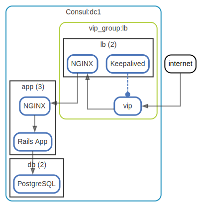

# 3-Tier Architecture

  [ <a href="../input/ndiag.descriptions/_index.md">:pencil2: Edit description</a> ]

## Views

| Name | Description |
| --- | --- |
| [overview](view-overview.md) | <a href="../input/ndiag.descriptions/_view-overview.md">:pencil2:</a> |
| [http-lb](view-http-lb.md) | <a href="../input/ndiag.descriptions/_view-http-lb.md">:pencil2:</a> |

## Nodes

| Name (node count) | Description |
| --- | --- |
| [lb](node-lb.md) (2) | Load balancer |
| [app](node-app.md) (3) | Application |
| [db](node-db.md) (2) | Database |

## Layers

| Name | Description |
| --- | --- |
| [Consul](layer-consul.md) | Consul DC |
| [vip_group](layer-vip_group.md) | A group of virtual IP and nodes/components to handle it. |

## Labels

| Name | Description |
| --- | --- |
| [app](label-app.md) | App-DB |
| [http](label-http.md) | HTTP request flow |
| [lang:ruby](label-lang_ruby.md) | Ruby |

---

> Generated by [ndiag](https://github.com/k1LoW/ndiag)
