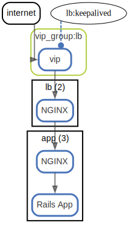

# http

HTTP request flow

  [ <a href="../input/ndiag.descriptions/_label-http.md">:pencil2: Edit description</a> ]

## Relations
internet -> vip

  [ <a href="../input/ndiag.descriptions/_relation-internet-c6eb5ba.md">:pencil2: Edit description</a> ]

| # | Component | Description |
| --- | --- | --- |
| 0 | internet |  <a href="../input/ndiag.descriptions/_component-internet.md">:pencil2:</a> |
| 1 | vip_group:lb:vip |  <a href="../input/ndiag.descriptions/_component-vip_group_lb_vip.md">:pencil2:</a> |

  [ <a href="../input/ndiag.descriptions/_relation-vip_group_lb_vip-630ad09.md">:pencil2: Edit description</a> ]

| # | Component | Description |
| --- | --- | --- |
| 0 | vip_group:lb:vip |  <a href="../input/ndiag.descriptions/_component-vip_group_lb_vip.md">:pencil2:</a> |
| 1 | lb-*:nginx |  <a href="../input/ndiag.descriptions/_component-lb-__nginx.md">:pencil2:</a> |

  [ <a href="../input/ndiag.descriptions/_relation-lb-__nginx-84bca39.md">:pencil2: Edit description</a> ]

| # | Component | Description |
| --- | --- | --- |
| 0 | lb-*:nginx |  <a href="../input/ndiag.descriptions/_component-lb-__nginx.md">:pencil2:</a> |
| 1 | app-*:nginx |  <a href="../input/ndiag.descriptions/_component-app-__nginx.md">:pencil2:</a> |
| 2 | app-*:rails |  <a href="../input/ndiag.descriptions/_component-app-__rails.md">:pencil2:</a> |

  [ <a href="../input/ndiag.descriptions/_relation-lb-__keepalived-5e60b00.md">:pencil2: Edit description</a> ]

| # | Component | Description |
| --- | --- | --- |
| 0 | lb-*:keepalived |  <a href="../input/ndiag.descriptions/_component-lb-__keepalived.md">:pencil2:</a> |
| 1 | vip_group:lb:vip |  <a href="../input/ndiag.descriptions/_component-vip_group_lb_vip.md">:pencil2:</a> |

---

> Generated by [ndiag](https://github.com/k1LoW/ndiag)
