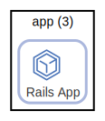

# lang:ruby

Ruby

  [ <a href="../input/ndiag.descriptions/_label-lang_ruby.md">:pencil2: Edit description</a> ]

## Nodes

| Name (node count) | Description |
| --- | --- |

## Relations
---

> Generated by [ndiag](https://github.com/k1LoW/ndiag)
