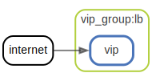
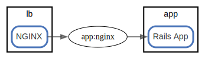
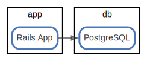
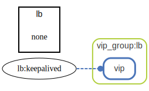

# overview

  [ <a href="../input/ndiag.descriptions/_view-overview.md">:pencil2: Edit description</a> ]

## Nodes

| Name (node count) | Description |
| --- | --- |
| [lb](node-lb.md) (2) | Load balancer |
| [app](node-app.md) (3) | Application |
| [db](node-db.md) (2) | Database |

## Relations

##### `internet-4046636`

  [ <a href="../input/ndiag.descriptions/_relation-internet-4046636.md">:pencil2: Edit description</a> ]

| # | Component | Description |
| --- | --- | --- |
| 0 | internet |  <a href="../input/ndiag.descriptions/_component-internet.md">:pencil2:</a> |
| 1 | vip_group:lb:vip |  <a href="../input/ndiag.descriptions/_component-vip_group_lb_vip.md">:pencil2:</a> |

---

##### `vip_group:lb:vip-f0e7297`

  [ <a href="../input/ndiag.descriptions/_relation-vip_group_lb_vip-f0e7297.md">:pencil2: Edit description</a> ]

| # | Component | Description |
| --- | --- | --- |
| 0 | vip_group:lb:vip |  <a href="../input/ndiag.descriptions/_component-vip_group_lb_vip.md">:pencil2:</a> |
| 1 | lb:nginx |  <a href="../input/ndiag.descriptions/_component-lb_nginx.md">:pencil2:</a> |

---

##### `lb:nginx-514d407`

  [ <a href="../input/ndiag.descriptions/_relation-lb_nginx-514d407.md">:pencil2: Edit description</a> ]

| # | Component | Description |
| --- | --- | --- |
| 0 | lb:nginx |  <a href="../input/ndiag.descriptions/_component-lb_nginx.md">:pencil2:</a> |
| 1 | app:nginx |  <a href="../input/ndiag.descriptions/_component-app_nginx.md">:pencil2:</a> |
| 2 | app:rails app |  <a href="../input/ndiag.descriptions/_component-app_rails_app.md">:pencil2:</a> |

---

##### `app:rails app-7e41335`

  [ <a href="../input/ndiag.descriptions/_relation-app_rails_app-7e41335.md">:pencil2: Edit description</a> ]

| # | Component | Description |
| --- | --- | --- |
| 0 | app:rails app |  <a href="../input/ndiag.descriptions/_component-app_rails_app.md">:pencil2:</a> |
| 1 | db:postgresql |  <a href="../input/ndiag.descriptions/_component-db_postgresql.md">:pencil2:</a> |

---

##### `lb:keepalived-afc5653`

  [ <a href="../input/ndiag.descriptions/_relation-lb_keepalived-afc5653.md">:pencil2: Edit description</a> ]

| # | Component | Description |
| --- | --- | --- |
| 0 | lb:keepalived |  <a href="../input/ndiag.descriptions/_component-lb_keepalived.md">:pencil2:</a> |
| 1 | vip_group:lb:vip |  <a href="../input/ndiag.descriptions/_component-vip_group_lb_vip.md">:pencil2:</a> |

---
## Layers

| Name | Description |
| --- | --- |
| [vip_group](layer-vip_group.md) | A group of virtual IP and nodes/components to handle it. |

## Labels

| Name | Description |
| --- | --- |
| [app](label-app.md) | App-DB |
| [http](label-http.md) | HTTP request flow |
| [lang:ruby](label-lang_ruby.md) | Ruby |

---

> Generated by [ndiag](https://github.com/k1LoW/ndiag)
