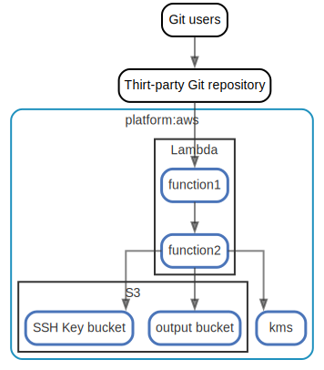

# Git to S3 Webhooks

See https://d1.awsstatic.com/webteam/architecture-icons/Q32020/AWS-Architecture-Icons-Deck_For-Light-BG_20200911.pptx.b238f9167071d2e7dccf32957782161dd1fe7a56.zip

  [ <a href="../input/ndiag.descriptions/_index.md">:pencil2: Edit description</a> ]

## Views

| Name | Description |
| --- | --- |
| [overview](view-overview.md) | <a href="../input/ndiag.descriptions/_view-overview.md">:pencil2:</a> |

## Nodes

| Name | Description |
| --- | --- |
| [Lambda](node-lambda.md) | <a href="../input/ndiag.descriptions/_node-lambda.md">:pencil2:</a> |
| [S3](node-s3.md) | <a href="../input/ndiag.descriptions/_node-s3.md">:pencil2:</a> |

## Layers

| Name | Description |
| --- | --- |
| [platform](layer-platform.md) | <a href="../input/ndiag.descriptions/_layer-platform.md">:pencil2:</a> |

## Labels

| Name | Description |
| --- | --- |

---

> Generated by [ndiag](https://github.com/k1LoW/ndiag)
