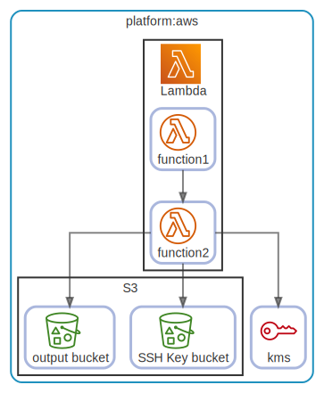

# platform

  [ <a href="../input/ndiag.descriptions/_layer-platform.md">:pencil2: Edit description</a> ]

## platform:aws

  [ <a href="../input/ndiag.descriptions/_cluster-platform_aws.md">:pencil2: Edit description</a> ]

### Cluster components

| Name | Description |
| --- | --- |
| platform:aws:kms | <a href="../input/ndiag.descriptions/_component-platform_aws_kms.md">:pencil2:</a> |
### Nodes

| Name | Description |
| --- | --- |
| [Lambda](node-lambda.md) | <a href="../input/ndiag.descriptions/_node-lambda.md">:pencil2:</a> |
| [S3](node-s3.md) | <a href="../input/ndiag.descriptions/_node-s3.md">:pencil2:</a> |

---

> Generated by [ndiag](https://github.com/k1LoW/ndiag)
