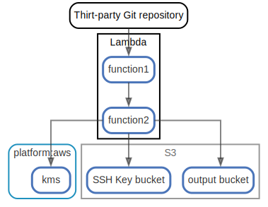

# Lambda

  [ <a href="../input/ndiag.descriptions/_node-lambda.md">:pencil2: Edit description</a> ]

## Components

| Name | Description | From (Relation) | To (Relation) |
| --- | --- | --- | --- |
| lambda:function1 |  <a href="../input/ndiag.descriptions/_component-lambda_function1.md">:pencil2:</a> | thirt-party git repository | [lambda:function2](node-lambda.md) |
| lambda:function2 |  <a href="../input/ndiag.descriptions/_component-lambda_function2.md">:pencil2:</a> | [lambda:function1](node-lambda.md) | [s3:ssh key bucket](node-s3.md) / [s3:output bucket](node-s3.md) / [platform:aws:kms](layer-platform.md#platformaws) |

## Labels

| Name | Description |
| --- | --- |

---

> Generated by [ndiag](https://github.com/k1LoW/ndiag)
