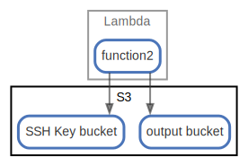

# S3

  [ <a href="../input/ndiag.descriptions/_node-s3.md">:pencil2: Edit description</a> ]

## Components

| Name | Description | From (Relation) | To (Relation) |
| --- | --- | --- | --- |
| s3:ssh key bucket |  <a href="../input/ndiag.descriptions/_component-s3_ssh_key_bucket.md">:pencil2:</a> | [lambda:function2](node-lambda.md) |  |
| s3:output bucket |  <a href="../input/ndiag.descriptions/_component-s3_output_bucket.md">:pencil2:</a> | [lambda:function2](node-lambda.md) |  |

## Labels

| Name | Description |
| --- | --- |

---

> Generated by [ndiag](https://github.com/k1LoW/ndiag)
