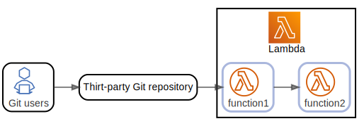
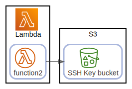
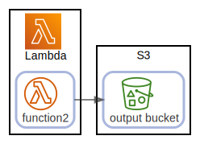
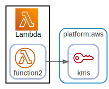

# overview

  [ <a href="../input/ndiag.descriptions/_view-overview.md">:pencil2: Edit description</a> ]

## Nodes

| Name | Description |
| --- | --- |
| [Lambda](node-lambda.md) | <a href="../input/ndiag.descriptions/_node-lambda.md">:pencil2:</a> |
| [S3](node-s3.md) | <a href="../input/ndiag.descriptions/_node-s3.md">:pencil2:</a> |

## Relations

  [ <a href="../input/ndiag.descriptions/_relation-git_users-14ba713.md">:pencil2: Edit description</a> ]

| # | Component | Description |
| --- | --- | --- |
| 0 | git users |  <a href="../input/ndiag.descriptions/_component-git_users.md">:pencil2:</a> |
| 1 | thirt-party git repository |  <a href="../input/ndiag.descriptions/_component-thirt-party_git_repository.md">:pencil2:</a> |
| 2 | lambda:function1 |  <a href="../input/ndiag.descriptions/_component-lambda_function1.md">:pencil2:</a> |
| 3 | lambda:function2 |  <a href="../input/ndiag.descriptions/_component-lambda_function2.md">:pencil2:</a> |

---

  [ <a href="../input/ndiag.descriptions/_relation-lambda_function2-a1cbfde.md">:pencil2: Edit description</a> ]

| # | Component | Description |
| --- | --- | --- |
| 0 | lambda:function2 |  <a href="../input/ndiag.descriptions/_component-lambda_function2.md">:pencil2:</a> |
| 1 | s3:ssh key bucket |  <a href="../input/ndiag.descriptions/_component-s3_ssh_key_bucket.md">:pencil2:</a> |

---

  [ <a href="../input/ndiag.descriptions/_relation-lambda_function2-86c8d48.md">:pencil2: Edit description</a> ]

| # | Component | Description |
| --- | --- | --- |
| 0 | lambda:function2 |  <a href="../input/ndiag.descriptions/_component-lambda_function2.md">:pencil2:</a> |
| 1 | s3:output bucket |  <a href="../input/ndiag.descriptions/_component-s3_output_bucket.md">:pencil2:</a> |

---

  [ <a href="../input/ndiag.descriptions/_relation-lambda_function2-7ef7b6c.md">:pencil2: Edit description</a> ]

| # | Component | Description |
| --- | --- | --- |
| 0 | lambda:function2 |  <a href="../input/ndiag.descriptions/_component-lambda_function2.md">:pencil2:</a> |
| 1 | platform:aws:kms |  <a href="../input/ndiag.descriptions/_component-platform_aws_kms.md">:pencil2:</a> |

---
## Layers

| Name | Description |
| --- | --- |
| [platform](layer-platform.md) | <a href="../input/ndiag.descriptions/_layer-platform.md">:pencil2:</a> |

## Labels

| Name | Description |
| --- | --- |

---

> Generated by [ndiag](https://github.com/k1LoW/ndiag)
