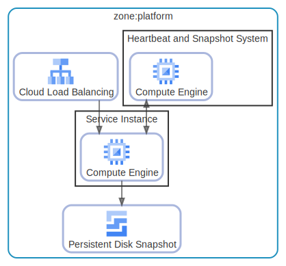

# zone

  [ <a href="../input/ndiag.descriptions/_layer-zone.md">:pencil2: Edit description</a> ]

## zone:platform

  [ <a href="../input/ndiag.descriptions/_cluster-zone_platform.md">:pencil2: Edit description</a> ]

### Cluster components

| Name | Description |
| --- | --- |
| zone:platform:Cloud Load Balancing | <a href="../input/ndiag.descriptions/_component-zone_platform_cloud_load_balancing.md">:pencil2:</a> |
| zone:platform:Persistent Disk Snapshot | <a href="../input/ndiag.descriptions/_component-zone_platform_persistent_disk_snapshot.md">:pencil2:</a> |
### Nodes

| Name | Description |
| --- | --- |

---

> Generated by [ndiag](https://github.com/k1LoW/ndiag)
