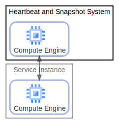

# Heartbeat and Snapshot System

  [ <a href="../input/ndiag.descriptions/_node-heartbeat_and_snapshot_system.md">:pencil2: Edit description</a> ]

## Components

| Name | Description | From (Relation) | To (Relation) |
| --- | --- | --- | --- |
| heartbeat and snapshot system:compute engine |  <a href="../input/ndiag.descriptions/_component-heartbeat_and_snapshot_system_compute_engine.md">:pencil2:</a> | [service instance:compute engine](node-service_instance.md) | [service instance:compute engine](node-service_instance.md) |

## Labels

| Name | Description |
| --- | --- |

---

> Generated by [ndiag](https://github.com/k1LoW/ndiag)
