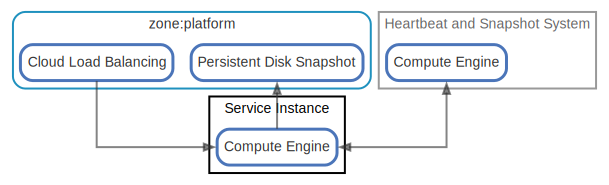

# Service Instance

  [ <a href="../input/ndiag.descriptions/_node-service_instance.md">:pencil2: Edit description</a> ]

## Components

| Name | Description | From (Relation) | To (Relation) |
| --- | --- | --- | --- |
| service instance:compute engine |  <a href="../input/ndiag.descriptions/_component-service_instance_compute_engine.md">:pencil2:</a> | [zone:platform:cloud load balancing](layer-zone.md#zoneplatform) / [heartbeat and snapshot system:compute engine](node-heartbeat_and_snapshot_system.md) | [heartbeat and snapshot system:compute engine](node-heartbeat_and_snapshot_system.md) / [zone:platform:persistent disk snapshot](layer-zone.md#zoneplatform) |

## Labels

| Name | Description |
| --- | --- |

---

> Generated by [ndiag](https://github.com/k1LoW/ndiag)
