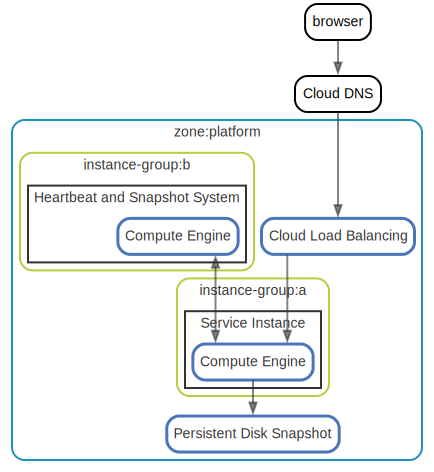
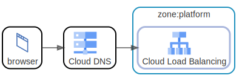
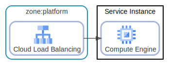
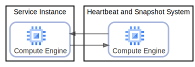
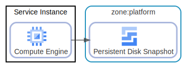

# overview

  [ <a href="../input/ndiag.descriptions/_view-overview.md">:pencil2: Edit description</a> ]

## Nodes

| Name | Description |
| --- | --- |
| [Service Instance](node-service_instance.md) | <a href="../input/ndiag.descriptions/_node-service_instance.md">:pencil2:</a> |
| [Heartbeat and Snapshot System](node-heartbeat_and_snapshot_system.md) | <a href="../input/ndiag.descriptions/_node-heartbeat_and_snapshot_system.md">:pencil2:</a> |

## Relations

  [ <a href="../input/ndiag.descriptions/_relation-browser-3bb13e8.md">:pencil2: Edit description</a> ]

| # | Component | Description |
| --- | --- | --- |
| 0 | browser |  <a href="../input/ndiag.descriptions/_component-browser.md">:pencil2:</a> |
| 1 | cloud dns |  <a href="../input/ndiag.descriptions/_component-cloud_dns.md">:pencil2:</a> |
| 2 | zone:platform:cloud load balancing |  <a href="../input/ndiag.descriptions/_component-zone_platform_cloud_load_balancing.md">:pencil2:</a> |

---

  [ <a href="../input/ndiag.descriptions/_relation-zone_platform_cloud_load_balancing-55e948d.md">:pencil2: Edit description</a> ]

| # | Component | Description |
| --- | --- | --- |
| 0 | zone:platform:cloud load balancing |  <a href="../input/ndiag.descriptions/_component-zone_platform_cloud_load_balancing.md">:pencil2:</a> |
| 1 | service instance:compute engine |  <a href="../input/ndiag.descriptions/_component-service_instance_compute_engine.md">:pencil2:</a> |

---

  [ <a href="../input/ndiag.descriptions/_relation-service_instance_compute_engine-2f9d9af.md">:pencil2: Edit description</a> ]

| # | Component | Description |
| --- | --- | --- |
| 0 | service instance:compute engine |  <a href="../input/ndiag.descriptions/_component-service_instance_compute_engine.md">:pencil2:</a> |
| 1 | heartbeat and snapshot system:compute engine |  <a href="../input/ndiag.descriptions/_component-heartbeat_and_snapshot_system_compute_engine.md">:pencil2:</a> |
| 2 | service instance:compute engine |  <a href="../input/ndiag.descriptions/_component-service_instance_compute_engine.md">:pencil2:</a> |

---

  [ <a href="../input/ndiag.descriptions/_relation-service_instance_compute_engine-ee4a537.md">:pencil2: Edit description</a> ]

| # | Component | Description |
| --- | --- | --- |
| 0 | service instance:compute engine |  <a href="../input/ndiag.descriptions/_component-service_instance_compute_engine.md">:pencil2:</a> |
| 1 | zone:platform:persistent disk snapshot |  <a href="../input/ndiag.descriptions/_component-zone_platform_persistent_disk_snapshot.md">:pencil2:</a> |

---
## Layers

| Name | Description |
| --- | --- |
| [zone](layer-zone.md) | <a href="../input/ndiag.descriptions/_layer-zone.md">:pencil2:</a> |
| [instance-group](layer-instance-group.md) | <a href="../input/ndiag.descriptions/_layer-instance-group.md">:pencil2:</a> |

## Labels

| Name | Description |
| --- | --- |

---

> Generated by [ndiag](https://github.com/k1LoW/ndiag)
