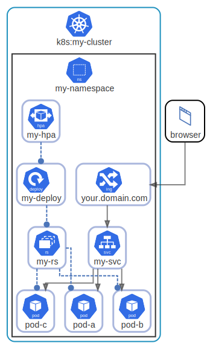
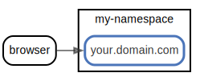
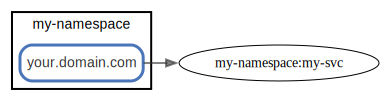
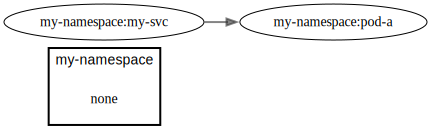
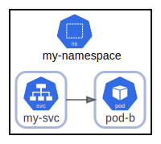
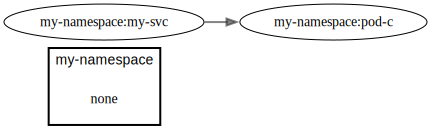
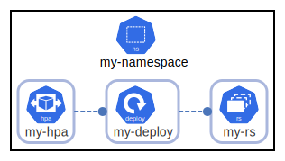
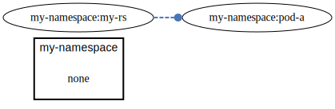
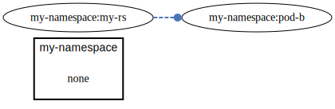
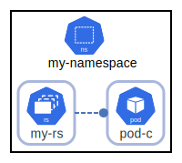

# overview

  [ <a href="../input/ndiag.descriptions/_view-overview.md">:pencil2: Edit description</a> ]

## Nodes

| Name | Description |
| --- | --- |
| [my-namespace](node-my-namespace.md) | <a href="../input/ndiag.descriptions/_node-my-namespace.md">:pencil2:</a> |

## Relations

  [ <a href="../input/ndiag.descriptions/_relation-browser-66ffe84.md">:pencil2: Edit description</a> ]

| # | Component | Description |
| --- | --- | --- |
| 0 | browser |  <a href="../input/ndiag.descriptions/_component-browser.md">:pencil2:</a> |
| 1 | my-namespace:your.domain.com |  <a href="../input/ndiag.descriptions/_component-my-namespace_your.domain.com.md">:pencil2:</a> |

  [ <a href="../input/ndiag.descriptions/_relation-my-namespace_your.domain.com-0eaf9ea.md">:pencil2: Edit description</a> ]

| # | Component | Description |
| --- | --- | --- |
| 0 | my-namespace:your.domain.com |  <a href="../input/ndiag.descriptions/_component-my-namespace_your.domain.com.md">:pencil2:</a> |
| 1 | my-namespace:my-svc |  <a href="../input/ndiag.descriptions/_component-my-namespace_my-svc.md">:pencil2:</a> |

  [ <a href="../input/ndiag.descriptions/_relation-my-namespace_my-svc-c6b3357.md">:pencil2: Edit description</a> ]

| # | Component | Description |
| --- | --- | --- |
| 0 | my-namespace:my-svc |  <a href="../input/ndiag.descriptions/_component-my-namespace_my-svc.md">:pencil2:</a> |
| 1 | my-namespace:pod-a |  <a href="../input/ndiag.descriptions/_component-my-namespace_pod-a.md">:pencil2:</a> |

  [ <a href="../input/ndiag.descriptions/_relation-my-namespace_my-svc-020c27f.md">:pencil2: Edit description</a> ]

| # | Component | Description |
| --- | --- | --- |
| 0 | my-namespace:my-svc |  <a href="../input/ndiag.descriptions/_component-my-namespace_my-svc.md">:pencil2:</a> |
| 1 | my-namespace:pod-b |  <a href="../input/ndiag.descriptions/_component-my-namespace_pod-b.md">:pencil2:</a> |

  [ <a href="../input/ndiag.descriptions/_relation-my-namespace_my-svc-ee29bd4.md">:pencil2: Edit description</a> ]

| # | Component | Description |
| --- | --- | --- |
| 0 | my-namespace:my-svc |  <a href="../input/ndiag.descriptions/_component-my-namespace_my-svc.md">:pencil2:</a> |
| 1 | my-namespace:pod-c |  <a href="../input/ndiag.descriptions/_component-my-namespace_pod-c.md">:pencil2:</a> |

  [ <a href="../input/ndiag.descriptions/_relation-my-namespace_my-hpa-adaea56.md">:pencil2: Edit description</a> ]

| # | Component | Description |
| --- | --- | --- |
| 0 | my-namespace:my-hpa |  <a href="../input/ndiag.descriptions/_component-my-namespace_my-hpa.md">:pencil2:</a> |
| 1 | my-namespace:my-deploy |  <a href="../input/ndiag.descriptions/_component-my-namespace_my-deploy.md">:pencil2:</a> |
| 2 | my-namespace:my-rs |  <a href="../input/ndiag.descriptions/_component-my-namespace_my-rs.md">:pencil2:</a> |

  [ <a href="../input/ndiag.descriptions/_relation-my-namespace_my-rs-af55dbf.md">:pencil2: Edit description</a> ]

| # | Component | Description |
| --- | --- | --- |
| 0 | my-namespace:my-rs |  <a href="../input/ndiag.descriptions/_component-my-namespace_my-rs.md">:pencil2:</a> |
| 1 | my-namespace:pod-a |  <a href="../input/ndiag.descriptions/_component-my-namespace_pod-a.md">:pencil2:</a> |

  [ <a href="../input/ndiag.descriptions/_relation-my-namespace_my-rs-5314af7.md">:pencil2: Edit description</a> ]

| # | Component | Description |
| --- | --- | --- |
| 0 | my-namespace:my-rs |  <a href="../input/ndiag.descriptions/_component-my-namespace_my-rs.md">:pencil2:</a> |
| 1 | my-namespace:pod-b |  <a href="../input/ndiag.descriptions/_component-my-namespace_pod-b.md">:pencil2:</a> |

  [ <a href="../input/ndiag.descriptions/_relation-my-namespace_my-rs-a25eb5a.md">:pencil2: Edit description</a> ]

| # | Component | Description |
| --- | --- | --- |
| 0 | my-namespace:my-rs |  <a href="../input/ndiag.descriptions/_component-my-namespace_my-rs.md">:pencil2:</a> |
| 1 | my-namespace:pod-c |  <a href="../input/ndiag.descriptions/_component-my-namespace_pod-c.md">:pencil2:</a> |

## Layers

| Name | Description |
| --- | --- |
| [k8s](layer-k8s.md) | <a href="../input/ndiag.descriptions/_layer-k8s.md">:pencil2:</a> |

## Labels

| Name | Description |
| --- | --- |
| [limits:b](label-limits_b.md) | <a href="../input/ndiag.descriptions/_label-limits_b.md">:pencil2:</a> |
| [netpol:a](label-netpol_a.md) | <a href="../input/ndiag.descriptions/_label-netpol_a.md">:pencil2:</a> |
| [quota:c](label-quota_c.md) | <a href="../input/ndiag.descriptions/_label-quota_c.md">:pencil2:</a> |

---

> Generated by [ndiag](https://github.com/k1LoW/ndiag)
