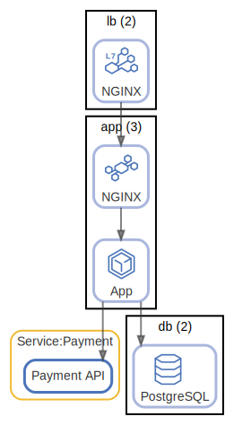

# app

App-DB

  [ <a href="../../ndiag.descriptions/_label-app.md">:pencil2: Edit description</a> ]

## Relations

  [ <a href="../../ndiag.descriptions/_relation-lb_nginx-514d407.md">:pencil2: Edit description</a> ]

| # | Component | Description |
| --- | --- | --- |
| 0 | lb:nginx |  <a href="../../ndiag.descriptions/_component-lb_nginx.md">:pencil2:</a> |
| 1 | app:nginx |  <a href="../../ndiag.descriptions/_component-app_nginx.md">:pencil2:</a> |
| 2 | app:rails app |  <a href="../../ndiag.descriptions/_component-app_rails_app.md">:pencil2:</a> |

  [ <a href="../../ndiag.descriptions/_relation-app_rails_app-7e41335.md">:pencil2: Edit description</a> ]

| # | Component | Description |
| --- | --- | --- |
| 0 | app:rails app |  <a href="../../ndiag.descriptions/_component-app_rails_app.md">:pencil2:</a> |
| 1 | db:postgresql |  <a href="../../ndiag.descriptions/_component-db_postgresql.md">:pencil2:</a> |

---

> Generated by [ndiag](https://github.com/k1LoW/ndiag)
