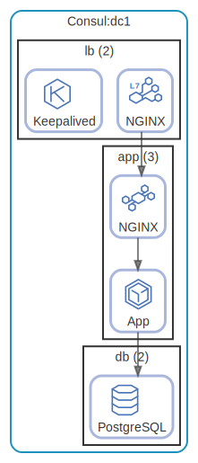

# Consul

Consul DC

  [ <a href="../../ndiag.descriptions/_layer-consul.md">:pencil2: Edit description</a> ]

## Consul:dc1

  [ <a href="../../ndiag.descriptions/_cluster-consul_dc1.md">:pencil2: Edit description</a> ]

### Nodes

| Name (node count) | Description |
| --- | --- |
| [lb](node-lb.md) (2) | Load balancer |
| [app](node-app.md) (3) | Application |
| [db](node-db.md) (2) | Database |

---

> Generated by [ndiag](https://github.com/k1LoW/ndiag)
