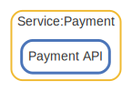

# Service

  [ <a href="../../ndiag.descriptions/_layer-service.md">:pencil2: Edit description</a> ]

## Service:Payment

  [ <a href="../../ndiag.descriptions/_cluster-service_payment.md">:pencil2: Edit description</a> ]

### Cluster components

| Name | Description |
| --- | --- |
| Service:Payment:Payment API | <a href="../../ndiag.descriptions/_component-service_payment_payment_api.md">:pencil2:</a> |
### Nodes

| Name | Description |
| --- | --- |

---

> Generated by [ndiag](https://github.com/k1LoW/ndiag)
