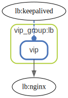

# vip_group

  [ <a href="../../ndiag.descriptions/_layer-vip_group.md">:pencil2: Edit description</a> ]

## vip_group:lb

  [ <a href="../../ndiag.descriptions/_cluster-vip_group_lb.md">:pencil2: Edit description</a> ]

### Cluster components

| Name | Description |
| --- | --- |
| vip_group:lb:vip | <a href="../../ndiag.descriptions/_component-vip_group_lb_vip.md">:pencil2:</a> |
### Nodes

| Name | Description |
| --- | --- |

---

> Generated by [ndiag](https://github.com/k1LoW/ndiag)
