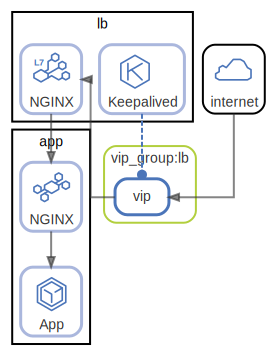

# http

  [ <a href="../../ndiag.descriptions/_label-http.md">:pencil2: Edit description</a> ]

## Nodes

| Name | Description |
| --- | --- |
| [lb](node-lb.md) | <a href="../../ndiag.descriptions/_node-lb.md">:pencil2:</a> |
| [app](node-app.md) | <a href="../../ndiag.descriptions/_node-app.md">:pencil2:</a> |

## Relations

##### `internet-4046636`

  [ <a href="../../ndiag.descriptions/_relation-internet-4046636.md">:pencil2: Edit description</a> ]

| # | Component | Description |
| --- | --- | --- |
| 0 | internet |  <a href="../../ndiag.descriptions/_component-internet.md">:pencil2:</a> |
| 1 | vip_group:lb:vip |  <a href="../../ndiag.descriptions/_component-vip_group_lb_vip.md">:pencil2:</a> |

---

##### `vip_group:lb:vip-f0e7297`

  [ <a href="../../ndiag.descriptions/_relation-vip_group_lb_vip-f0e7297.md">:pencil2: Edit description</a> ]

| # | Component | Description |
| --- | --- | --- |
| 0 | vip_group:lb:vip |  <a href="../../ndiag.descriptions/_component-vip_group_lb_vip.md">:pencil2:</a> |
| 1 | lb:nginx |  <a href="../../ndiag.descriptions/_component-lb_nginx.md">:pencil2:</a> |

---

##### `lb:nginx-2750eb0`

  [ <a href="../../ndiag.descriptions/_relation-lb_nginx-2750eb0.md">:pencil2: Edit description</a> ]

| # | Component | Description |
| --- | --- | --- |
| 0 | lb:nginx |  <a href="../../ndiag.descriptions/_component-lb_nginx.md">:pencil2:</a> |
| 1 | app:nginx |  <a href="../../ndiag.descriptions/_component-app_nginx.md">:pencil2:</a> |
| 2 | app:app |  <a href="../../ndiag.descriptions/_component-app_app.md">:pencil2:</a> |

---

##### `lb:keepalived-afc5653`

  [ <a href="../../ndiag.descriptions/_relation-lb_keepalived-afc5653.md">:pencil2: Edit description</a> ]

| # | Component | Description |
| --- | --- | --- |
| 0 | lb:keepalived |  <a href="../../ndiag.descriptions/_component-lb_keepalived.md">:pencil2:</a> |
| 1 | vip_group:lb:vip |  <a href="../../ndiag.descriptions/_component-vip_group_lb_vip.md">:pencil2:</a> |

---
---

> Generated by [ndiag](https://github.com/k1LoW/ndiag)
