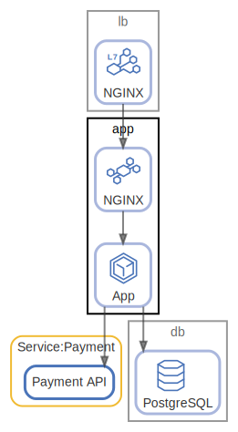

# app

  [ <a href="../../ndiag.descriptions/_node-app.md">:pencil2: Edit description</a> ]

## Components

| Name | Description | From (Relation) | To (Relation) |
| --- | --- | --- | --- |
| app:nginx |  <a href="../../ndiag.descriptions/_component-app_nginx.md">:pencil2:</a> | [lb:nginx](node-lb.md) | [app:app](node-app.md) |
| app:app |  <a href="../../ndiag.descriptions/_component-app_app.md">:pencil2:</a> | [app:nginx](node-app.md) | [db:postgresql](node-db.md) / [service:payment:payment api](layer-service.md#servicepayment) |

## Labels

| Name | Description |
| --- | --- |
| [app](label-app.md) | <a href="../../ndiag.descriptions/_label-app.md">:pencil2:</a> |
| [http](label-http.md) | <a href="../../ndiag.descriptions/_label-http.md">:pencil2:</a> |
| [lang:ruby](label-lang_ruby.md) | <a href="../../ndiag.descriptions/_label-lang_ruby.md">:pencil2:</a> |

---

> Generated by [ndiag](https://github.com/k1LoW/ndiag)
