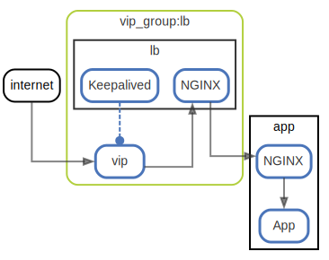

# http access

  [ <a href="../../ndiag.descriptions/_view-http_access.md">:pencil2: Edit description</a> ]

## Layers

| Name | Description |
| --- | --- |
| [vip_group](layer-vip_group.md) | <a href="../../ndiag.descriptions/_layer-vip_group.md">:pencil2:</a> |

## Nodes

| Name | Description |
| --- | --- |
| [lb](node-lb.md) | <a href="../../ndiag.descriptions/_node-lb.md">:pencil2:</a> |
| [app](node-app.md) | <a href="../../ndiag.descriptions/_node-app.md">:pencil2:</a> |

## Labels

| Name | Description |
| --- | --- |
| [http](label-http.md) | <a href="../../ndiag.descriptions/_label-http.md">:pencil2:</a> |

---

> Generated by [ndiag](https://github.com/k1LoW/ndiag)
