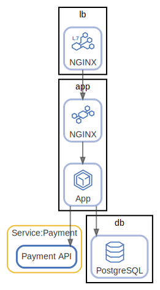

# app

App-DB

  [ <a href="../../ndiag.descriptions/_label-app.md">:pencil2: Edit description</a> ]

## Nodes

| Name | Description |
| --- | --- |
| [lb](node-lb.md) | Load balancer |
| [app](node-app.md) | Application |
| [db](node-db.md) | Database |

## Relations

  [ <a href="../../ndiag.descriptions/_relation-lb_nginx-2750eb0.md">:pencil2: Edit description</a> ]

| # | Component | Description |
| --- | --- | --- |
| 0 | lb:nginx |  <a href="../../ndiag.descriptions/_component-lb_nginx.md">:pencil2:</a> |
| 1 | app:nginx |  <a href="../../ndiag.descriptions/_component-app_nginx.md">:pencil2:</a> |
| 2 | app:app |  <a href="../../ndiag.descriptions/_component-app_app.md">:pencil2:</a> |

  [ <a href="../../ndiag.descriptions/_relation-app_app-fc502aa.md">:pencil2: Edit description</a> ]

| # | Component | Description |
| --- | --- | --- |
| 0 | app:app |  <a href="../../ndiag.descriptions/_component-app_app.md">:pencil2:</a> |
| 1 | db:postgresql |  <a href="../../ndiag.descriptions/_component-db_postgresql.md">:pencil2:</a> |

  [ <a href="../../ndiag.descriptions/_relation-app_app-34fd077.md">:pencil2: Edit description</a> ]

| # | Component | Description |
| --- | --- | --- |
| 0 | app:app |  <a href="../../ndiag.descriptions/_component-app_app.md">:pencil2:</a> |
| 1 | service:payment:payment api |  <a href="../../ndiag.descriptions/_component-service_payment_payment_api.md">:pencil2:</a> |

---

> Generated by [ndiag](https://github.com/k1LoW/ndiag)
