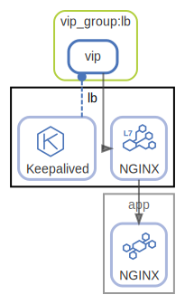

# lb

Load balancer

  [ <a href="../../ndiag.descriptions/_node-lb.md">:pencil2: Edit description</a> ]

## Components

| Name | Description | From (Relation) | To (Relation) |
| --- | --- | --- | --- |
| lb:nginx |  <a href="../../ndiag.descriptions/_component-lb_nginx.md">:pencil2:</a> | [vip_group:lb:vip](layer-vip_group.md#vip_grouplb) | [app:nginx](node-app.md) |
| lb:keepalived |  <a href="../../ndiag.descriptions/_component-lb_keepalived.md">:pencil2:</a> |  | [vip_group:lb:vip](layer-vip_group.md#vip_grouplb) |

## Labels

| Name | Description |
| --- | --- |
| [app](label-app.md) | App-DB |
| [http](label-http.md) | HTTP request flow |

---

> Generated by [ndiag](https://github.com/k1LoW/ndiag)
