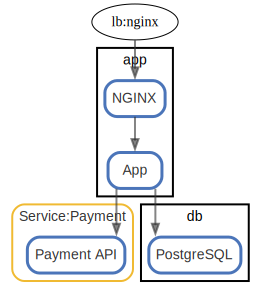

# app

  [ <a href="../../ndiag.descriptions/_view-app.md">:pencil2: Edit description</a> ]

## Layers

| Name | Description |
| --- | --- |
| [vip_group](layer-vip_group.md) | A group of virtual IP and nodes/components to handle it. |

## Nodes

| Name | Description |
| --- | --- |
| [lb](node-lb.md) | Load balancer |
| [app](node-app.md) | Application |
| [db](node-db.md) | Database |

## Labels

| Name | Description |
| --- | --- |
| [app](label-app.md) | App-DB |

---

> Generated by [ndiag](https://github.com/k1LoW/ndiag)
