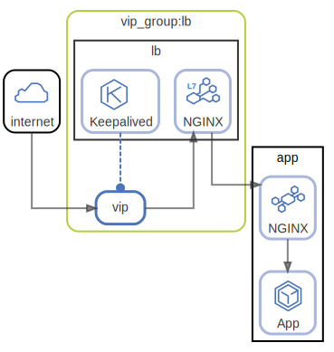

# http access

  [ <a href="../../ndiag.descriptions/_view-http_access.md">:pencil2: Edit description</a> ]

## Layers

| Name | Description |
| --- | --- |
| [vip_group](layer-vip_group.md) | A group of virtual IP and nodes/components to handle it. |

## Nodes

| Name | Description |
| --- | --- |
| [lb](node-lb.md) | Load balancer |
| [app](node-app.md) | Application |

## Labels

| Name | Description |
| --- | --- |
| [http](label-http.md) | HTTP request flow |

---

> Generated by [ndiag](https://github.com/k1LoW/ndiag)
