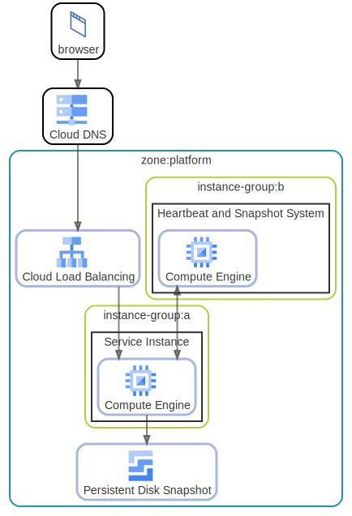

# Simple Compute Engine Usage

See https://docs.google.com/presentation/d/1vjm5YdmOH5LrubFhHf1vlqW2O9Z2UqdWA8biN3e8K5U/edit#slide=id.g19bd855f64_0_292

  [ <a href="../input/ndiag.descriptions/_index.md">:pencil2: Edit description</a> ]

## Diagrams

| Name | Description |
| --- | --- |
| [overview](diagram-overview.md) | <a href="../input/ndiag.descriptions/_diagram-overview.md">:pencil2:</a> |

## Layers

| Name | Description |
| --- | --- |
| [zone](layer-zone.md) | <a href="../input/ndiag.descriptions/_layer-zone.md">:pencil2:</a> |
| [instance-group](layer-instance-group.md) | <a href="../input/ndiag.descriptions/_layer-instance-group.md">:pencil2:</a> |

## Nodes

| Name | Description |
| --- | --- |
| [Service Instance](node-service_instance.md) | <a href="../input/ndiag.descriptions/_node-service_instance.md">:pencil2:</a> |
| [Heartbeat and Snapshot System](node-heartbeat_and_snapshot_system.md) | <a href="../input/ndiag.descriptions/_node-heartbeat_and_snapshot_system.md">:pencil2:</a> |

## Labels

| Name | Description |
| --- | --- |

---

> Generated by [ndiag](https://github.com/k1LoW/ndiag)
